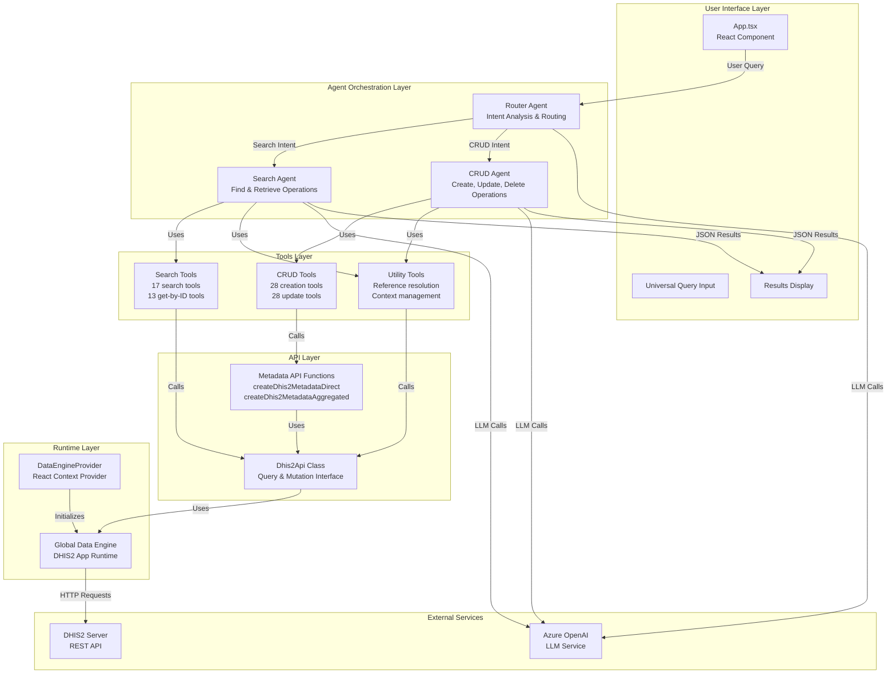

# DHIS2 AI Suite - Architecture Diagram

## System Architecture Overview

This document describes the architecture of the DHIS2 Multi-Agent Metadata Assistant application.

## High-Level Architecture



## Component Details

### 1. User Interface Layer (`App.tsx`)

**Purpose**: Main React component that provides the user interface

**Key Features**:
- Universal query input field
- Query processing state management
- Results display (tables, success/error messages)
- Integration with DHIS2 app-runtime for user authentication

**State Management**:
- `universalQuery`: User's natural language query
- `queryResults`: Parsed JSON results from agents
- `isProcessing`: Loading state
- `queryErrorMessage`: Error handling

### 2. Agent Orchestration Layer

#### Router Agent (`router-agent.ts`)

**Purpose**: Intelligent routing based on user intent analysis

**Responsibilities**:
- Analyze user queries for intent (search vs CRUD)
- Route to appropriate specialized agent
- Keywords detection:
  - **Search**: find, search, show, list, get, display, view, see, lookup, retrieve
  - **CRUD**: create, add, make, new, update, change, modify, edit, build, setup

**Tools**:
- `routeToSearchAgent`: Delegates to search agent
- `routeToCRUDAgent`: Delegates to CRUD agent

#### Search Agent (`search-agent.ts`)

**Purpose**: Handle all search and retrieval operations

**Capabilities**:
- Search metadata by name (case-insensitive)
- Get resources by ID
- Retrieve data values
- Resolve resource references

**Tools Available** (30 tools):
- **Search Tools** (17): DataElements, OrganisationUnits, Categories, Programs, Indicators, etc.
- **Get-by-ID Tools** (13): Retrieve specific resources by ID
- **Specialized**: Data values retrieval
- **Utility**: Reference resolution

#### CRUD Agent (`crud-agent.ts`)

**Purpose**: Handle all creation, update, and modification operations

**Capabilities**:
- Create new metadata resources
- Update existing resources
- Manage dependencies automatically
- Batch operations support

**Tools Available** (60+ tools):
- **Creation Tools** (28): All DHIS2 metadata types
- **Update Tools** (28): Update all metadata types
- **LLM-First Tools**: `createDhis2DataElement`, `createDhis2Option`
- **Utility**: Reference resolution, context management

### 3. Tools Layer (`utils/tools/metadata/`)

**Purpose**: Structured tools that interact with DHIS2 API

**Architecture**:
- **Base Tool** (`base-tool.ts`): Foundation for all tools
- **Structured Tools** (`structured-tools.ts`): Type-safe tool implementations
- **Schemas** (`schemas.ts`): Zod validation schemas for all metadata types
- **Batch Manager** (`batch-manager.ts`): Batch operation handling
- **Helpers** (`helpers.ts`): Utility functions for reference resolution

**Tool Categories**:

1. **Search Tools**: Query DHIS2 metadata by name/ID
2. **Creation Tools**: Create new metadata resources with automatic dependency handling
3. **Update Tools**: Modify existing metadata resources
4. **Utility Tools**: Context management, reference resolution

### 4. API Layer (`utils/app-runtime/`)

#### Dhis2Api Class (`dhis2-api.ts`)

**Purpose**: Abstraction layer over DHIS2 App Runtime

**Key Methods**:
- `generateId()`: Generate unique DHIS2 IDs
- `searchMetadata()`: Search metadata by name
- `mutate()`: Execute mutations (create/update)
- `query()`: Execute queries (read operations)

#### Metadata API Functions

**Purpose**: High-level functions for metadata operations

**Functions**:
- `createDhis2MetadataDirect()`: Create single resource
- `createDhis2MetadataAggregated()`: Batch create multiple resources
- `checkResourceExists()`: Verify resource existence before creation

### 5. Runtime Layer (`utils/app-runtime/`)

#### DataEngineProvider (`data-engine.provider.tsx`)

**Purpose**: React provider that initializes global data engine

**Functionality**:
- Wraps the app to provide DHIS2 data engine context
- Initializes global engine reference for tool access
- Uses `useDataEngine()` hook from `@dhis2/app-runtime`

#### Global Data Engine (`dhis2-provider.ts`)

**Purpose**: Singleton pattern for accessing DHIS2 data engine

**Functionality**:
- Stores global reference to DHIS2 App Runtime data engine
- Provides `getDataEngine()` function for tools to access
- Ensures engine is available before tool execution

## Data Flow

### Search Operation Flow

```
User Query: "Find all data elements with HIV"
    ↓
Router Agent (analyzes intent → "search")
    ↓
Search Agent (receives query)
    ↓
searchDhis2DataElements tool (called by agent)
    ↓
Dhis2Api.searchMetadata("dataElements", "HIV")
    ↓
Global Data Engine.query()
    ↓
DHIS2 Server API: GET /api/dataElements?filter=name:ilike:HIV
    ↓
Results returned as JSON
    ↓
Displayed in UI table
```

### Creation Operation Flow

```
User Query: "Create a data element for patient age"
    ↓
Router Agent (analyzes intent → "create")
    ↓
CRUD Agent (receives query)
    ↓
createDhis2DataElement tool (called by agent)
    ↓
Extract structured data (name, valueType, domainType, etc.)
    ↓
Schema validation (Zod)
    ↓
createDhis2MetadataDirect("dataElements", payload)
    ↓
Dhis2Api.mutate() with metadata payload
    ↓
Global Data Engine.mutate()
    ↓
DHIS2 Server API: POST /api/metadata
    ↓
Success response with created resource
    ↓
Displayed in UI as success message
```

## Key Design Patterns

### 1. Multi-Agent Architecture
- **Router Agent**: Intent analysis and routing
- **Specialized Agents**: Domain-specific operations (search vs CRUD)
- **Separation of Concerns**: Each agent has focused responsibilities

### 2. Tool-Based Architecture
- **LangChain Tools**: All DHIS2 operations exposed as tools
- **Type Safety**: Zod schemas for validation
- **Automatic Dependency Resolution**: Tools handle prerequisites automatically

### 3. Provider Pattern
- **DataEngineProvider**: React context for DHIS2 runtime
- **Global Engine Access**: Singleton pattern for tool access
- **Initialization**: Ensures engine is available before use

### 4. API Abstraction
- **Dhis2Api Class**: Unified interface for all DHIS2 operations
- **Metadata Functions**: High-level helpers for common operations
- **Error Handling**: Consistent error handling across layers

## Technology Stack

- **Frontend**: React 18, TypeScript
- **DHIS2 Integration**: @dhis2/app-runtime v3.14.6
- **AI/LLM**: LangChain, LangGraph, Azure OpenAI
- **Validation**: Zod v4.1.12
- **State Management**: React hooks, LangGraph state annotations

## Environment Configuration

The application requires the following environment variables:
- `DHIS2_OPENAI_MODEL`: Azure OpenAI model name
- `DHIS2_AZURE_KEY`: Azure OpenAI API key
- `DHIS2_AZURE_ENDPOINT`: Azure OpenAI endpoint URL
- `DHIS2_AZURE_API_DEPLOYMENT_NAME`: Deployment name
- `DHIS2_AZURE_API_VERSION`: API version

## File Structure

```
src/
├── App.tsx                          # Main UI component
├── agent.ts                         # Legacy metadata agent (not used in routing)
├── agents/
│   ├── index.ts                     # Agent exports
│   ├── router-agent.ts              # Intent routing agent
│   ├── search-agent.ts              # Search operations agent
│   └── crud-agent.ts                # CRUD operations agent
├── utils/
│   ├── state.ts                     # LangGraph state annotations
│   ├── app-runtime/
│   │   ├── data-engine.provider.tsx # React provider
│   │   ├── dhis2-provider.ts        # Global engine access
│   │   └── dhis2-api.ts             # API abstraction layer
│   └── tools/
│       └── metadata/
│           ├── index.ts             # Tool exports
│           ├── base-tool.ts         # Base tool implementation
│           ├── structured-tools.ts  # Type-safe tools
│           ├── schemas.ts           # Zod validation schemas
│           ├── batch-manager.ts     # Batch operations
│           └── helpers.ts           # Utility functions
└── locales/                         # Internationalization
```

## Agent Communication Protocol

All agents communicate using JSON format:

**Success Response**:
```json
{
  "success": true,
  "message": "Operation completed",
  "results": [...],  // For search/batch operations
  "data": {...},     // For single create operations
  "count": 10        // Optional count
}
```

**Error Response**:
```json
{
  "success": false,
  "error": "Error message",
  "routedTo": "search|crud"
}
```

## Dependency Management

The system automatically handles dependencies:
- DataElements → CategoryCombos → Categories → CategoryOptions
- Programs → TrackedEntityTypes → TrackedEntityAttributes
- Indicators → IndicatorTypes
- All dependencies created automatically without user confirmation

## Security Considerations

- All API calls go through DHIS2 App Runtime (handles authentication)
- User permissions enforced by DHIS2 server
- No direct API keys in client code
- Azure OpenAI credentials stored in environment variables

