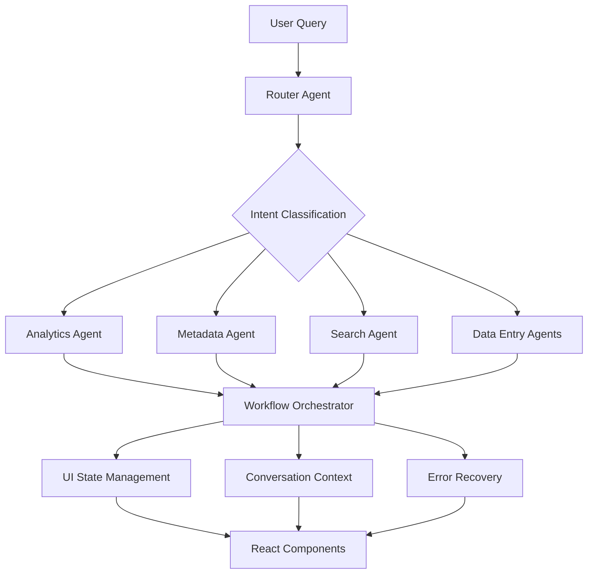

# 📚 DHIS2 AI Suite Documentation

Welcome to the comprehensive documentation for the DHIS2 AI Suite. This documentation provides everything a developer needs to understand, navigate, and extend the system.

## 🗂️ Documentation Structure

### 📖 **Getting Started**
- **[System Overview](./overview.md)** - High-level architecture and concepts
- **[Architecture Deep Dive](./architecture.md)** - Detailed technical implementation
- **[Quick Start](./development/setup.md)** - Setup and development environment

### 🤖 **Core Components**

#### **Agents**
The system uses multiple specialized AI agents, each handling different types of workflows:

- **[Router Agent](./agents/router-agent.md)** - Workflow classification and agent routing
- **[Metadata Agent](./agents/metadata-agent.md)** - DHIS2 metadata CRUD operations (30+ tools)
- **[Analytics Agent](./agents/analytics-agent.md)** - Data analysis and visualization workflows
- **[Search Agent](./agents/search-agent.md)** - Intelligent metadata search
- **[Tracker Agent](./agents/tracker-agent.md)** - Patient data processing and tracker entity management
- **[Aggregate Data Agent](./agents/aggregate-data-agent.md)** - CSV processing and aggregate data entry
- **[Data Entry Router](./agents/data-entry-router.md)** - Data entry workflow coordination

#### **Workflow Orchestrator**
Coordinates all system components and manages user interactions:

- **[Overview](./orchestrator/overview.md)** - UI state management and workflow lifecycle
- **[Conversation Management](./orchestrator/conversation.md)** - Message threading and file handling
- **[Error Handling](./orchestrator/error-handling.md)** - Error classification and recovery strategies
- **[Progress Tracking](./orchestrator/progress.md)** - Workflow progress indication and checkpoints

#### **State Management**
- **[Graph State](./state-management/graph-state.md)** - StateGraph annotations and transitions
- **[Conversation Context](./state-management/conversation-context.md)** - Context persistence and session management

### 🧩 **User Interface**
- **[Components Overview](./components/overview.md)** - React component architecture
- **[Message Renderer](./components/message-renderer.md)** - Conversation message types and rendering
- **[Data Grids](./components/data-grids.md)** - Interactive data entry and validation components

### 🛠️ **Tools & Utilities**
- **[Metadata Tools](./tools/metadata-tools.md)** - DHIS2 API integration and batch operations
- **[LLM Services](./tools/llm-services.md)** - Classification, extraction, and multilingual support
- **[Utilities](./tools/utilities.md)** - Helper functions and service integrations

### 🚀 **Development**
- **[Setup Guide](./development/setup.md)** - Environment configuration and dependencies
- **[Workflows](./development/workflows.md)** - Coding standards, testing, and contribution guidelines
- **[Extensions](./development/extensions.md)** - Adding new agents and tools

## 🎯 **Key Concepts**

### **Agent-Based Architecture**
The system uses specialized AI agents built with LangChain/LangGraph:
- **Router Agent**: Classifies user intent and routes to appropriate specialized agents
- **Domain Agents**: Handle specific workflows (metadata, analytics, data entry, etc.)
- **StateGraphs**: Manage complex multi-step workflows with error recovery

### **Workflow Orchestration**
- **UI State Management**: Centralized control of user interface states
- **Conversation Context**: Maintains context across interactions for follow-up queries
- **Error Recovery**: Intelligent error classification and user-guided recovery options
- **Progress Tracking**: Real-time workflow progress with checkpointing

### **Data Flow Patterns**
1. **User Query** → Router Agent (intent classification)
2. **Agent Routing** → Specialized agent (workflow execution)
3. **Orchestrator Coordination** → UI updates and conversation management
4. **Result Rendering** → Specialized message types and interactive components

## 🔍 **Finding What You Need**

### **I'm new to the codebase**
Start with **[System Overview](./overview.md)** and **[Setup Guide](./development/setup.md)**

### **I need to modify an agent**
Check the specific agent documentation in **[Agents](./agents/)** section

### **I need to add UI functionality**
See **[Components](./components/)** and **[Orchestrator](./orchestrator/)** documentation

### **I need to add DHIS2 operations**
Review **[Metadata Tools](./tools/metadata-tools.md)** and **[Metadata Agent](./agents/metadata-agent.md)**

### **I need to handle errors or state**
Check **[Error Handling](./orchestrator/error-handling.md)** and **[State Management](./state-management/)**

## 📊 **Architecture Diagrams**

## 🤝 **Contributing to Documentation**

- Follow the established structure and formatting standards
- Include code examples and diagrams where helpful
- Cross-reference related documentation sections
- Update the checklist when adding new content
- Test documentation with new developers

## 📝 **Documentation Standards**

- **Language**: Technical but accessible to intermediate developers
- **Format**: Markdown with consistent heading hierarchy
- **Diagrams**: Mermaid for flows, ASCII for simple relationships
- **Code**: Include relevant code snippets and file paths
- **Links**: Cross-reference related sections
- **Updates**: Keep synchronized with code changes

---

*For questions or contributions, see the [development workflows](./development/workflows.md).*
