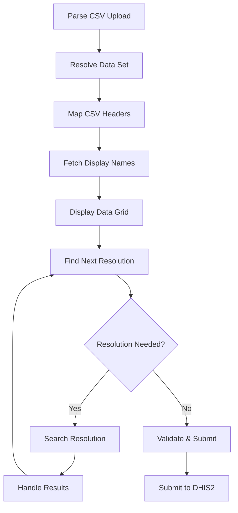

# 📊 Aggregate Data Agent - CSV Processing & Data Entry

## Overview

The Aggregate Data Agent is a comprehensive StateGraph-based workflow for processing CSV files and managing aggregate data value submission to DHIS2. It handles the complete pipeline from CSV upload through data validation to DHIS2 data value creation, with intelligent name resolution and error recovery capabilities.

**File Location**: `src/agents/aggregate-data-agent.ts`

**Architecture**: LangGraph StateGraph with 15+ workflow nodes and complex data processing

## 🏗️ Core Architecture

### StateGraph Workflow


### State Annotation
Extensive state management for complex data processing workflows:

```typescript
const AggregateDataAnnotation = Annotation.Root({
    // Data Processing
    uploadedData: Annotation<any[][]>,          // Raw CSV data
    resolutionState: Annotation<Map<string, ResolutionItem>>, // Name resolution tracking
    processedData: Annotation<AggregatedDataValue[]>, // Final DHIS2 data values

    // Metadata Resolution
    dataSet: Annotation<{id: string, name: string, resolved: boolean}>,
    resourceDetails: Annotation<Map<string, {exists: boolean, details?: any}>>,
    displayNames: Annotation<Map<string, string>>,

    // Workflow Control
    uiAction: Annotation<string>,
    currentResolution: Annotation<ResolutionContext>,
    finalResult: Annotation<any>
});
```

## 🔄 Workflow Nodes

### 1. `parse_csv_upload` - Initial Processing

**Purpose**: Handle CSV upload and extract contextual information

**Key Logic**:
- **File Registry Integration**: Access orchestrator's file registry for CSV files
- **Context Extraction**: Use LLM to extract data set names and contextual info
- **Fallback Methods**: Support multiple file reference patterns
- **Follow-up Detection**: Identify requests to modify existing data sets

**Decision Branching**:
```typescript
if (hasCSVFile) {
    return { uiAction: 'resolve_data_set' };
} else {
    return { uiAction: 'show_data_grid' }; // Empty grid for manual entry
}
```

### 2. `resolve_data_set` - Dataset Resolution

**Purpose**: Identify the target DHIS2 data set for data submission

**LLM-Powered Extraction**:
```typescript
const dataSetName = await extractDataSetNameFromPrompt(content);
// Searches: "Submit data to HIV Monthly Report" → "HIV Monthly Report"
```

**Resolution Strategy**:
1. **LLM Extraction**: Parse data set name from user query
2. **DHIS2 Search**: Query data sets by extracted name
3. **Auto-resolution**: Single match → automatic selection
4. **User Selection**: Multiple matches → interactive selection
5. **Recovery**: No matches → guided recovery options

### 3. `map_csv_headers` - Intelligent Header Mapping

**Purpose**: Map CSV column headers to DHIS2 field requirements

**LLM-Powered Mapping**:
```typescript
const mappingResult = await mapHeadersWithLLM(originalHeaders, requiredFields);
// Supports multilingual headers (English, French, Spanish, Arabic, Portuguese)
```

**Supported Fields**:
- `dataElement`: Measurable data points
- `orgUnit`: Geographic/facility locations
- `period`: Time periods (YYYYMM format)
- `categoryOptionCombos`: Disaggregation categories
- `attributeOptionCombos`: Additional attributes
- `value`: Numeric data values

**Multilingual Support**:
- English: "Data Element", "Organisation Unit", "Value"
- French: "Élément de données", "Unité d'organisation", "Valeur"
- Spanish: "Elemento de datos", "Unidad organizativa", "Valor"
- Arabic: "عنصر البيانات", "وحدة التنظيم", "القيمة"

### 4. `fetch_display_names` - Resource Name Resolution

**Purpose**: Convert resolved IDs to human-readable names for display

**Batch API Calls**:
```typescript
const batchResults = await batchValidateResources(resourcesByType);
// Single API call validates all resolved IDs across resource types
```

### 5. `display_data_grid` - Interactive Data Review

**Purpose**: Present processed data in interactive grid for validation

**Grid Features**:
```typescript
{
    type: 'data_grid',
    data: {
        headers: ['dataElement', 'orgUnit', 'period', 'categoryOptionCombos', 'value'],
        displayHeaders: ['Data Element', 'Organisation Unit', 'Time Period', 'Category Combo', 'Value'],
        rows: processedRows,
        resolutionState: resolutionMap,
        actions: ['resolve_all', 'edit_cell', 'delete_row', 'confirm_submit']
    }
}
```

### 6. `find_next_resolution` - Resolution Orchestration

**Purpose**: Identify next field requiring name-to-ID resolution

**Resolution Tracking**:
```typescript
interface ResolutionItem {
    rowIndex: number;
    colIndex: number;
    originalValue: string;
    fieldType: 'dataElement' | 'orgUnit' | 'categoryOptionCombos';
    status: 'pending' | 'searching' | 'needs_selection' | 'resolved';
}
```

### 7. `search_resolution_matches` - Name Resolution

**Purpose**: Search DHIS2 for matches to user-provided names

**API Integration**:
```typescript
// Search appropriate endpoint based on field type
switch (item.fieldType) {
    case 'dataElement': searchDhis2DataElements.invoke({ query: searchQuery });
    case 'orgUnit': searchDhis2OrganisationUnits.invoke({ query: searchQuery });
    case 'categoryOptionCombos': searchDhis2CategoryOptions.invoke({ query: searchQuery });
}
```

### 8. `handle_multiple_matches` - User Selection

**Purpose**: Present multiple search results for user choice

**Interactive Selection**:
```typescript
{
    type: 'resolution_selection',
    message: `Multiple matches found for "${searchQuery}". Please select:`,
    data: {
        options: searchResults.map(r => ({ id: r.id, name: r.name })),
        allowMultiple: false
    }
}
```

### 9. `auto_resolve_single_match` - Automatic Resolution

**Purpose**: Automatically resolve when only one match exists

```typescript
if (searchResults.length === 1) {
    // Auto-resolve single match
    updatedResolutionState.set(key, {
        ...item,
        resolvedId: searchResults[0].id,
        status: 'resolved'
    });
}
```

### 10. `handle_no_matches` - Recovery Guidance

**Purpose**: Provide recovery options when no matches found

**Recovery Strategies**:
```typescript
recoveryOptions: [
    {
        id: 'manual_entry',
        label: 'Enter manually',
        description: 'Enter the correct ID manually'
    },
    {
        id: 'skip_field',
        label: 'Skip this field',
        description: 'Continue without resolving (may cause validation errors)'
    }
]
```

### 11. `validate_and_submit` - Final Validation & Submission

**Purpose**: Validate all resolutions and submit data values to DHIS2

**Batch Validation**:
```typescript
const batchValidationResults = await batchValidateResources(resourcesByType);
// Validates all resolved IDs in single API call
```

**DHIS2 Submission**:
```typescript
const mutationConfig = {
    resource: 'dataValues',
    type: 'create',
    data: dataValuePayload
};
```

## 🎯 Data Processing Features

### CSV Parsing
- **Flexible Parsing**: Handles quoted values, escaped commas
- **Format Detection**: Automatic delimiter detection
- **Error Handling**: Graceful handling of malformed CSV

### Name Resolution
- **Intelligent Search**: Context-aware name matching
- **Batch Processing**: Efficient validation of multiple resources
- **Fallback Options**: Manual entry when automatic resolution fails

### Data Validation
- **Type Checking**: Ensure numeric values for value fields
- **Required Fields**: Validate presence of mandatory DHIS2 fields
- **Reference Integrity**: Confirm all referenced resources exist

## 🔄 Follow-up Operations

### Data Set Modification
**Update Existing Data**:
```typescript
case 'update_data_set':
    // Parse criteria: "update row 3 to value 50"
    const { matchedDataValues } = parseUpdateCriteria(currentData, criteria);
    // Update via DHIS2 API
```

**Delete Data Values**:
```typescript
case 'delete_from_data_set':
    // Parse criteria: "delete rows where orgUnit is X"
    const deletePromises = matchedDataValues.map(dataValue => deleteAPI(dataValue));
```

### View Data Sets
**Display Existing Data**:
```typescript
case 'load_and_display_data_set':
    // Load submitted data from state
    const gridData = constructGridDataFromSubmittedData(dataSetInfo);
    return { finalResult: { type: 'data_grid', data: gridData } };
```

## 🚨 **Resilient Recovery Framework**

The Aggregate Data Agent implements a comprehensive recovery framework that transforms failures into guided recovery experiences, providing users with actionable options instead of hard stops.

### RecoveryContext Integration

#### Enhanced State Annotation with Recovery
```typescript
const AggregateDataAnnotation = Annotation.Root({
    // ... existing state fields

    // Recovery framework integration
    recoveryContext: Annotation<RecoveryContext | null>({
        reducer: (left, right) => right || left,
        default: () => null
    }),

    // Workflow pause/resume state
    workflowPaused: Annotation<boolean>({
        reducer: (left, right) => right ?? left,
        default: () => false
    }),

    selectedRecoveryAction: Annotation<string>({
        reducer: (left, right) => right || left,
        default: () => ''
    })
});
```

#### RecoveryContext Structure
```typescript
interface RecoveryContext {
    failedStep: string;                    // Which step failed
    errorDetails: any;                     // Detailed error information
    recoveryOptions: RecoveryOption[];     // Available recovery actions
    userGuidance: string;                  // User-friendly guidance
}

interface RecoveryOption {
    id: string;                           // Action identifier
    label: string;                        // User-facing label
    description: string;                  // Detailed description
    action: () => Promise<any>;           // Recovery implementation
    priority?: number;                    // Display priority
    requiresUserInput?: boolean;          // Whether user input needed
    automated?: boolean;                  // Whether fully automated
}
```

### Recovery Categories & Strategies

#### **1. Dataset Resolution Recovery**
**Failure Scenario**: No dataset found matching user query

**Recovery Options**:
```typescript
recoveryOptions: [
    {
        id: 'select_from_available',
        label: 'Select from available datasets',
        description: 'Browse and select from existing DHIS2 datasets',
        action: () => showDatasetSelection(),
        priority: 1,
        requiresUserInput: true
    },
    {
        id: 'create_new_dataset',
        label: 'Create new dataset',
        description: 'Guide user through dataset creation process',
        action: () => initiateDatasetCreation(),
        priority: 2,
        requiresUserInput: true
    },
    {
        id: 'search_different_terms',
        label: 'Search with different terms',
        description: 'Try alternative search terms or provide more context',
        action: () => promptForNewSearch(),
        priority: 3,
        requiresUserInput: true
    },
    {
        id: 'manual_entry',
        label: 'Enter dataset ID manually',
        description: 'Allow direct entry of DHIS2 dataset ID',
        action: () => showManualEntryForm(),
        priority: 4,
        requiresUserInput: true
    }
]
```

#### **2. Header Mapping Recovery**
**Failure Scenario**: LLM header mapping fails or produces incorrect mappings

**Recovery Options**:
```typescript
recoveryOptions: [
    {
        id: 'manual_mapping',
        label: 'Map columns manually',
        description: 'Interactive drag-and-drop column mapping interface',
        action: () => showMappingInterface(),
        priority: 1,
        requiresUserInput: true
    },
    {
        id: 'llm_retry_different_context',
        label: 'Retry with more context',
        description: 'Provide additional context to improve LLM mapping',
        action: () => promptForAdditionalContext(),
        priority: 2,
        requiresUserInput: true
    },
    {
        id: 'use_original_headers',
        label: 'Use original column names',
        description: 'Proceed with original headers (may cause validation issues)',
        action: () => proceedWithOriginalHeaders(),
        priority: 3,
        automated: true
    },
    {
        id: 'skip_mapping',
        label: 'Skip header mapping',
        description: 'Continue without intelligent mapping (basic validation only)',
        action: () => continueWithoutMapping(),
        priority: 4,
        automated: true
    }
]
```

#### **3. Partial Resolution Recovery**
**Failure Scenario**: Some fields resolve successfully, others fail

**Recovery Options**:
```typescript
recoveryOptions: [
    {
        id: 'continue_with_resolved',
        label: 'Continue with resolved items',
        description: 'Proceed with successfully resolved fields, flag unresolved ones',
        action: () => proceedWithPartialResolution(),
        priority: 1,
        automated: true
    },
    {
        id: 'batch_resolve_remaining',
        label: 'Resolve remaining items',
        description: 'Focus on resolving only the failed items',
        action: () => initiateBatchResolution(),
        priority: 2,
        requiresUserInput: true
    },
    {
        id: 'manual_override_all',
        label: 'Manual override for all',
        description: 'Manually specify all field mappings',
        action: () => showBulkManualEntry(),
        priority: 3,
        requiresUserInput: true
    }
]
```

#### **4. Validation Recovery**
**Failure Scenario**: Data validation fails for specific records

**Recovery Options**:
```typescript
recoveryOptions: [
    {
        id: 'highlight_validation_errors',
        label: 'Highlight validation errors',
        description: 'Show specific validation failures with correction suggestions',
        action: () => showValidationErrors(),
        priority: 1,
        automated: true
    },
    {
        id: 'auto_correct_common_issues',
        label: 'Auto-correct common issues',
        description: 'Automatically fix common validation problems',
        action: () => applyAutoCorrections(),
        priority: 2,
        automated: true
    },
    {
        id: 'interactive_correction',
        label: 'Interactive correction mode',
        description: 'Step-by-step guided correction of validation errors',
        action: () => enterInteractiveMode(),
        priority: 3,
        requiresUserInput: true
    },
    {
        id: 'skip_invalid_records',
        label: 'Skip invalid records',
        description: 'Continue with valid records only',
        action: () => filterValidRecords(),
        priority: 4,
        automated: true
    }
]
```

#### **5. CSV Parsing Recovery**
**Failure Scenario**: CSV file cannot be parsed due to format issues

**Recovery Options**:
```typescript
recoveryOptions: [
    {
        id: 'fix_csv_format',
        label: 'Fix CSV format issues',
        description: 'Guide user to correct common CSV formatting problems',
        action: () => showCSVFormatGuidance(),
        priority: 1,
        requiresUserInput: true
    },
    {
        id: 'alternative_delimiter',
        label: 'Try different delimiter',
        description: 'Attempt parsing with different field separators',
        action: () => tryAlternativeDelimiters(),
        priority: 2,
        automated: true
    },
    {
        id: 'upload_corrected_file',
        label: 'Upload corrected file',
        description: 'Allow user to upload a corrected version',
        action: () => promptForNewFile(),
        priority: 3,
        requiresUserInput: true
    },
    {
        id: 'manual_data_entry',
        label: 'Switch to manual entry',
        description: 'Enter data manually instead of file upload',
        action: () => switchToManualEntry(),
        priority: 4,
        automated: true
    }
]
```

### Recovery Workflow Integration

#### Conditional Recovery Edges
```typescript
// StateGraph with recovery edges
.addConditionalEdges('resolve_data_set',
    (state) => {
        if (state.recoveryContext) {
            return 'handle_recovery';  // Recovery needed
        }
        return 'map_csv_headers';     // Success path
    })
.addConditionalEdges('map_csv_headers',
    (state) => {
        if (state.recoveryContext) {
            return 'handle_recovery';  // Recovery needed
        }
        return 'fetch_display_names';  // Success path
    })
.addEdge('handle_recovery', 'recovery_selection')  // Present options
.addConditionalEdges('recovery_selection',
    (state) => state.selectedRecoveryAction)        // Route based on selection
```

#### Recovery Node Implementation
```typescript
async function handle_recovery(state: typeof AggregateDataAnnotation.State): Promise<Partial<typeof AggregateDataAnnotation.State>> {
    const recoveryContext = state.recoveryContext;

    if (!recoveryContext) {
        return { step: 'continue_processing' };
    }

    // Add recovery message to conversation
    orchestrator.addAssistantMessage(
        recoveryContext.userGuidance,
        'warning',
        {
            recoveryOptions: recoveryContext.recoveryOptions,
            failedStep: recoveryContext.failedStep,
            errorDetails: recoveryContext.errorDetails
        }
    );

    // Pause workflow for user decision
    return {
        workflowPaused: true,
        uiAction: 'show_recovery_options'
    };
}

async function recovery_selection(state: typeof AggregateDataAnnotation.State): Promise<Partial<typeof AggregateDataAnnotation.State>> {
    const selectedAction = state.selectedRecoveryAction;
    const recoveryContext = state.recoveryContext;

    if (!selectedAction || !recoveryContext) {
        return { workflowPaused: false };
    }

    // Find and execute selected recovery action
    const recoveryOption = recoveryContext.recoveryOptions.find(opt => opt.id === selectedAction);

    if (recoveryOption) {
        try {
            const recoveryResult = await recoveryOption.action();

            // Add success message
            orchestrator.addAssistantMessage(
                `✅ Recovery action completed: ${recoveryOption.label}`,
                'success'
            );

            return {
                workflowPaused: false,
                recoveryContext: null,
                selectedRecoveryAction: '',
                ...recoveryResult  // Include any state updates from recovery
            };
        } catch (error) {
            // Recovery failed - show error and retry options
            orchestrator.addAssistantMessage(
                `❌ Recovery action failed: ${error.message}`,
                'error',
                { recoveryError: error }
            );

            return {
                recoveryContext: {
                    ...recoveryContext,
                    errorDetails: error,
                    userGuidance: 'Recovery action failed. Please try a different option.'
                }
            };
        }
    }

    return { workflowPaused: false };
}
```

### UI Integration for Recovery

#### Recovery Modal Component
```typescript
// Integration with RecoveryModal component
orchestrator.addAssistantMessage(
    'Recovery options available',
    'warning',
    {
        recoveryOptions: recoveryContext.recoveryOptions,
        onSelectRecovery: (actionId: string) => {
            orchestrator.updateUIState({
                selectedRecoveryAction: actionId
            });
        }
    }
);
```

#### Progress Feedback During Recovery
```typescript
// Add progress messages during recovery
orchestrator.addProgressMessage('Attempting recovery: Searching alternative datasets...');

// Update progress as recovery proceeds
orchestrator.addProgressMessage('✅ Dataset found, proceeding with data processing...');
```

### Recovery Analytics & Learning

#### Recovery Pattern Tracking
```typescript
// Track recovery usage for continuous improvement
const recoveryAnalytics = {
    failurePoint: state.recoveryContext?.failedStep,
    selectedRecovery: state.selectedRecoveryAction,
    success: !state.recoveryContext,  // No recovery context means success
    timestamp: Date.now(),
    userId: state.userId
};

// Store for analysis and improvement
await trackRecoveryAnalytics(recoveryAnalytics);
```

#### Adaptive Recovery Suggestions
```typescript
// Learn from successful recoveries
const adaptiveOptions = await getAdaptiveRecoveryOptions(
    state.recoveryContext?.failedStep,
    state.userId
);

// Prioritize options based on historical success rates
recoveryContext.recoveryOptions = recoveryContext.recoveryOptions.map(option => ({
    ...option,
    priority: adaptiveOptions[option.id]?.priority || option.priority
}));
```

## 📊 Performance Optimizations

### API Efficiency
- **Batch Validation**: Single API call validates all resolved IDs
- **Multi-Resource Queries**: Combined queries for different resource types
- **Streaming Processing**: Handle large CSV files without memory issues

### LLM Optimization
- **Context Limiting**: Restrict conversation history for LLM calls
- **Caching**: Avoid redundant extractions and validations
- **Fallback Logic**: Regex-based fallbacks when LLM unavailable

### Memory Management
- **Resolution State**: Efficient Map-based tracking of resolution status
- **Streaming Results**: Process large datasets incrementally
- **Cleanup**: Automatic cleanup of temporary state

## 🎯 Usage Examples

### CSV Data Upload
```
1. User uploads CSV with columns: "Facility Name", "HIV Tests", "Period", "Value"
2. Agent resolves data set "HIV Monthly Report"
3. Agent maps headers using LLM (multilingual support)
4. Agent resolves "Facility Name" → orgUnit IDs
5. Agent displays grid for user validation
6. User confirms → Agent submits to DHIS2 data values API
```

### Manual Data Entry
```
1. User: "Enter data for HIV dataset"
2. Agent shows empty grid with DHIS2 field structure
3. User fills grid manually
4. Agent validates entries and submits
```

### Data Update
```
Previous: Data set "HIV Monthly Report" with 100 values
User: "Update row 5 to value 75"
Agent: Parses request, updates specific data value, refreshes display
```

### Follow-up Operations
```
User: "Show me the HIV data set"
Agent: Retrieves previously submitted data, displays in grid format
```

## 🔍 Debugging & Monitoring

### Key Logging Points
- CSV parsing success/failure with row counts
- Header mapping confidence levels
- Resolution success rates by field type
- DHIS2 API submission results and timing
- Recovery option usage patterns

### Common Issues
- **CSV Format**: Malformed files, encoding issues, delimiter problems
- **Name Resolution**: Ambiguous names, missing resources, permission issues
- **Data Validation**: Type mismatches, missing required fields
- **API Limits**: DHIS2 rate limiting, payload size restrictions

## 🚀 Extension Points

### Additional File Formats
- Excel (.xlsx, .xls) file support
- JSON data import
- XML data structures
- API-based data sources

### Enhanced Validation
- Cross-field validation rules
- Business rule validation
- Historical data comparison
- Automated data quality scoring

### Advanced Features
- Bulk data updates and corrections
- Data import templates and wizards
- Scheduled data imports
- Data transformation pipelines

---

The Aggregate Data Agent provides a comprehensive solution for processing aggregate health data from various sources, with intelligent validation, name resolution, and seamless DHIS2 integration.
