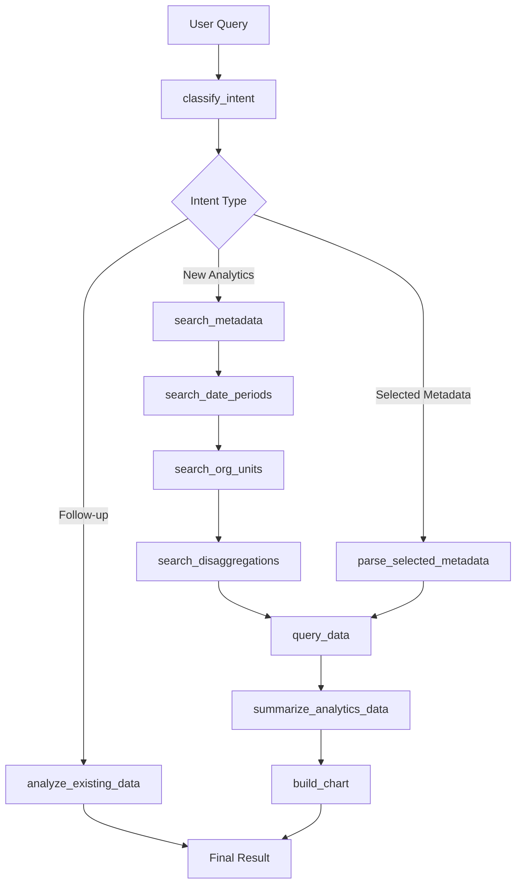

# 📊 Analytics Agent - Data Analysis & Visualization

## Overview

The Analytics Agent is a sophisticated StateGraph-based workflow that transforms natural language queries into interactive DHIS2 data visualizations. It handles the complete analytics pipeline from query understanding to chart generation, using LLM-powered metadata extraction and intelligent data processing.

**File Location**: `src/agents/analytics-graph-agent.ts`

**Architecture**: LangGraph StateGraph with 10+ workflow nodes

## 🏗️ Core Architecture

### StateGraph Structure


### State Annotation
The Analytics Agent uses comprehensive state management:

```typescript
const GraphAnnotation = Annotation.Root({
    // Input/Processing State
    messages: Annotation<any[]>,
    query: Annotation<string>,
    step: Annotation<string>,

    // Metadata Resolution State
    metadata: Annotation<any>,           // Indicators/dataElements
    datePeriodsMetadata: Annotation<any>, // Time periods
    orgUnitsMetadata: Annotation<any>,   // Organisation units
    disaggregationsMetadata: Annotation<any>, // Categories/disaggregations

    // Data Processing State
    data: Annotation<any>,              // Raw DHIS2 analytics data
    metaData: Annotation<any>,          // DHIS2 metadata response
    chart: Annotation<any>,             // Generated chart data
    dataSummary: Annotation<any>,       // Statistics and insights

    // Workflow Control State
    workflowId: Annotation<string>,
    workflowPaused: Annotation<boolean>,
    selectedItems: Annotation<any[]>,
    uiAction: Annotation<string>,
    recoveryAction: Annotation<string>,

    // Orchestrator Integration
    orchestrator: Annotation<any>,

    // Results
    finalResult: Annotation<any>,
    error: Annotation<string>
});
```

## 🔄 Workflow Nodes

### 1. `classify_intent` - Intent Classification

**Purpose**: Determine if query is new analytics, follow-up analysis, or selected metadata

**Key Logic**:
- **Context Analysis**: Check conversation history for previous analytics results
- **Pattern Matching**: Detect selected metadata patterns (`indicator:X(ID:Y)`)
- **LLM Classification**: Use LLM to classify intent type with confidence scoring

**Decision Tree**:
```typescript
if (intentClassification.type === 'followup_data_analysis' || hasSelectedMetadata) {
    return { step: hasSelectedMetadata ? 'parse_selected_metadata' : 'analyze_existing_data' };
} else {
    return { step: 'search_metadata' };
}
```

### 2. `analyze_existing_data` - Follow-up Analysis

**Purpose**: Analyze previously generated chart data based on follow-up questions

**Process**:
1. Retrieve last analytics result from conversation context
2. Use LLM to analyze existing data against follow-up query
3. Generate conversational insights without re-querying DHIS2

**Example**:
```
Previous: Chart showing HIV cases by district
Follow-up: "Which district has the highest rate?"
Result: Conversational analysis of existing chart data
```

### 3. `parse_selected_metadata` - Parse User Selections

**Purpose**: Extract metadata selections from follow-up queries

**Pattern Matching**:
```typescript
const regex = /(indicator|dataElement):([^,(]+)\(ID:([^)]+)\)/gi;
// Matches: "indicator:HIV Cases(ID:abc123)"
```

### 4. `search_metadata` - LLM-Powered Metadata Discovery

**Purpose**: Extract indicators/dataElements from natural language queries

**LLM Extraction Process**:
1. **Keyword Extraction**: Use LLM to identify relevant indicators/dataElements
2. **2-Level Search**: External API search → DHIS2 API verification
3. **User Selection**: Present multiple matches for user choice through orchestrator

**Fallback Logic**:
- If no keywords found, use original query for search
- Handle multiple matches with user selection workflow
- Auto-select single matches

### 5. `search_date_periods` - Time Period Extraction

**Purpose**: Extract temporal scope from queries using LLM

**Supported Patterns**:
- Explicit dates: "2024", "January 2024", "Q1 2024"
- Relative periods: "last month", "this year", "past 6 months"
- Multiple periods: "2023 and 2024"

**Default Fallback**: Current year if no periods detected

### 6. `search_org_units` - Geographic Scope Resolution

**Purpose**: Identify organisation units from location references

**LLM Extraction**:
- Geographic terms: countries, provinces, districts, facilities
- Administrative levels: "national level", "province level"
- Contextual defaults: Use root org unit if none specified

**Selection Workflow**:
- Multiple matches → User selection via orchestrator
- Single match → Auto-selection
- No matches → Fallback to root organisation unit

### 7. `search_disaggregations` - Category/Disaggregation Analysis

**Purpose**: Extract data disaggregation requirements (age, gender, etc.)

**Process**:
1. **Category Discovery**: Extract categories from dataElement categoryCombos
2. **LLM Filtering**: Use LLM to identify relevant disaggregations for query
3. **COC Mapping**: Build category option combo mappings for analytics API

**Technical Details**:
- Cross-references category options with existing COCs
- Filters to only valid, COC-backed options
- Generates `dimension:optionIds` format for DHIS2 analytics

### 8. `query_data` - DHIS2 Analytics API Integration

**Purpose**: Execute analytics queries against DHIS2 Analytics API

**Data Flow**:
```typescript
// Group indicators and dataElements
const dxDimensionIds = [...indicators, ...dataElements];

// Query with resolved parameters
const result = await queryAnalytics.invoke({
    indicators: dxDimensionIds,
    periods: resolvedPeriods,
    org_units: resolvedOrgUnits,
    disaggregations: formattedDimensions,
    include_coc_dimension: hasDataElements
});
```

**Error Handling**:
- No data scenarios with user-friendly messaging
- API error propagation with context
- Partial result handling

### 9. `summarize_analytics_data` - Statistical Analysis

**Purpose**: Generate human-readable insights and statistics

**Computations**:
- **Basic Stats**: Total records, values, averages, min/max
- **Data Quality**: Zero counts, non-zero percentages
- **Coverage**: Org unit, period, indicator coverage

**LLM-Generated Insights**:
```typescript
const summaryPrompt = `
Generate a humanized summary of these analytics results for: "${query}"

Statistics: ${JSON.stringify(stats)}
Context: ${JSON.stringify(metadata)}

Write a natural, conversational summary highlighting key insights.
`;
```

### 10. `build_chart` - Visualization Generation

**Purpose**: Create interactive charts from analytics data

**Lazy Loading Architecture**:
- **Chart Preparation**: Generate chart data without rendering
- **Lazy Rendering**: Charts render only when user clicks "View Chart"
- **Multiple Formats**: Support for bar, line, pie, and other chart types

**Chart Data Structure**:
```typescript
{
    success: true,
    message: summaryText,
    summary: { text, insights, statistics },
    chartAvailable: true,
    chartData: echartsConfig,  // Prepared but not rendered
    metadata: resolvedMetadata,
    queryData: rawAnalyticsData,
    chartRendered: false,      // Lazy loading flag
    actions: [{ type: 'view_chart', label: '📊 View Chart' }]
}
```

## 🎯 LLM Integration Patterns

### Intent Classification
```typescript
const classification = await llmClassificationService.classifyIntent(query);
// Returns: { intent, confidence, reasoning, alternatives }
```

### Metadata Extraction
```typescript
const keywords = await extractIndicatorKeywordsLLM.invoke({
    query,
    context: 'health analytics - extract measurable indicators'
});
// Returns: { keywordCandidates: [...] }
```

### Query Analysis
```typescript
const analysis = await llmClassificationService.analyzeQuery(query, {
    conversationContext: previousResults,
    previousAnalyticsAvailable: hasContext
});
// Returns: { requiresMetadata, isFollowUp, etc. }
```

## 🔄 Orchestrator Integration

### Progress Tracking
Each node updates progress with specific messages:
```typescript
updateProgress(2, 'Finding Indicators', 'Searching for relevant data indicators...', false);
state.orchestrator?.addProgressMessage('Searching for relevant data indicators...');
```

### User Selection Workflows
- **Metadata Selection**: Multiple indicators/dataElements
- **Org Unit Selection**: Geographic scope selection
- **Disaggregation Selection**: Category option selection

### Conversation Context
All results stored for future reference:
```typescript
addConversation(state.query, 'analytics', result, dataContext);
```

## 📊 Data Flow Architecture

### Analytics Pipeline
```
Query → Intent Classification → Metadata Resolution → Data Query → Summarization → Chart Prep → Result
         ↓                        ↓                    ↓              ↓            ↓
    LLM-based               LLM Extraction     DHIS2 Analytics    Statistics   Lazy Loading
    Classification          + API Search          API          Generation   Architecture
```

### State Transitions
- **Linear Flow**: Most workflows follow predictable sequence
- **Conditional Branching**: Intent classification determines path
- **Error Recovery**: Failed steps can trigger recovery workflows
- **User Interaction**: Selection steps pause workflow for input

## 🚨 Error Handling & Recovery

### Recovery Nodes
- `handle_query_parsing_recovery`: Rephrase query suggestions
- `handle_data_access_recovery`: Alternative data sources
- `handle_chart_generation_recovery`: Fallback to table format
- `handle_timeout_recovery`: Partial results or background processing

### Error Classification
```typescript
const classifiedError = await llmClassificationService.classifyError(error, context);
// Returns: { classification, severity, userMessage, recoveryStrategies }
```

## 📈 Performance Optimizations

### LLM Call Optimization
- **Context Window Management**: Limit conversation history
- **Caching**: Avoid redundant extractions
- **Batch Processing**: Group related operations

### API Efficiency
- **Single Analytics Call**: Use dx dimension for mixed indicator/dataElement queries
- **Pagination**: Handle large result sets
- **Conditional COC**: Include category option combos only when needed

### Memory Management
- **Lazy Chart Loading**: Charts prepared but not rendered until requested
- **State Cleanup**: Remove unnecessary state between steps
- **Reference Management**: Proper cleanup of resolved resources

## 🎯 Usage Examples

### Simple Analytics
```
Query: "Show me HIV testing trends for 2024"
Flow: classify_intent → search_metadata → search_date_periods → search_org_units → query_data → summarize → build_chart
```

### Follow-up Analysis
```
Query: "Which district has the highest numbers?"
Flow: classify_intent → analyze_existing_data → Final conversational insights
```

### Selected Metadata Analysis
```
Query: "Analyze using these selected metadata: indicator:HIV Cases(ID:abc123)"
Flow: classify_intent → parse_selected_metadata → query_data → summarize → build_chart
```

## 🔍 Debugging & Monitoring

### Key Logging Points
- Intent classification confidence scores
- Metadata extraction results
- API call timing and results
- Chart generation success/failure
- User selection interactions

### Common Issues
- **Metadata Resolution**: LLM extraction failures
- **API Timeouts**: Large queries timing out
- **Chart Rendering**: ECharts configuration issues
- **Context Loss**: Follow-up queries losing previous state

## 🚀 Extension Points

### Adding New Extraction Types
1. Create LLM extraction function (e.g., `extractProgramLLM`)
2. Add workflow node for new extraction type
3. Integrate into StateGraph with conditional edges
4. Update analytics API parameter mapping

### Custom Chart Types
- Extend chart generation logic
- Add new visualization templates
- Update lazy loading architecture
- Add chart-specific error handling

### Enhanced Analytics
- Add statistical analysis functions
- Implement trend detection algorithms
- Create comparative analysis features
- Add predictive analytics capabilities

---

The Analytics Agent represents a sophisticated implementation of conversational data analysis, transforming natural language queries into meaningful DHIS2 visualizations through intelligent metadata resolution and workflow orchestration.
