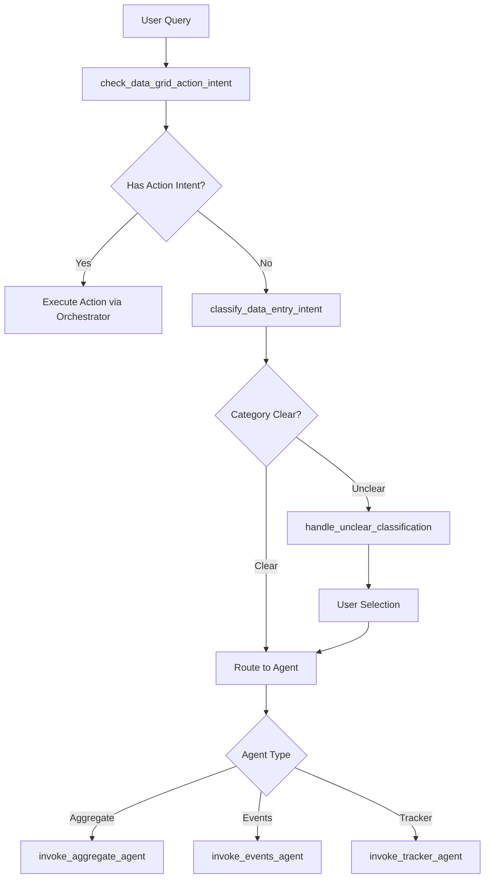

# 🔀 Routed Data Entry Agent - Data Entry Workflow Coordination

## Overview

The Routed Data Entry Agent is the central coordinator for all data entry operations in the DHIS2 AI Suite. It intelligently routes data entry requests between **aggregate data entry** (periodic/facility-level data) and **tracker data entry** (individual record management), while handling file processing, UI interactions, and workflow orchestration.

**File Location**: `src/agents/routed-data-entry-agent.ts`

**Key Responsibilities**:
- Route queries to appropriate data entry agents (aggregate, events, tracker)
- Handle data grid action intents (resolve, submit, save/cancel)
- Provide user clarification for ambiguous data entry categories
- Coordinate with WorkflowOrchestrator for UI state management
- Process file uploads and convert to secure references

## 🏗️ Architecture

The agent uses a **StateGraph** workflow with the following core components:



### State Structure

```typescript
const DataEntryRouterAnnotation = Annotation.Root({
    // Progress tracking
    workflowProgress: Annotation<ProgressState>,

    // Orchestrator reference
    orchestrator: Annotation<WorkflowOrchestrator>,

    // Workflow context
    dataEntryCategory: Annotation<string>, // 'aggregate_data' | 'events' | 'tracker' | 'unclear'
    originalQuery: Annotation<string>,
    dataEntryType: Annotation<'tracker' | 'aggregate' | null>, // From router agent context

    // Data grid action handling
    isDataValueUpdate: Annotation<boolean>,

    // Messages and final result
    messages: Annotation<any[]>,
    finalResult: Annotation<any>
});
```

## 🔄 Workflow Nodes

### 1. `check_data_grid_action_intent` - Action Intent Detection

**Purpose**: Detects natural language commands for data grid operations before category classification.

**Key Features**:
- **Data Grid Context**: Checks for recent data grid messages in conversation
- **Follow-up Context**: Uses `dataEntryType` from router agent for contextual routing
- **Action Types**:
  - `resolve_all`: Bulk resolve all pending items
  - `submit_data`: Submit resolved data to DHIS2
  - `confirm_save`: Save tracker data (review mode)
  - `cancel_save`: Cancel tracker data save
  - `update_data_value`: Update specific data value

**LLM Detection Logic**:
```typescript
const detectionPrompt = `
Analyze this data entry grid action query...

Actions: resolve_all, submit_data, confirm_save, cancel_save, update_data_value
Query: "${query}"
`;
```

### 2. `classify_data_entry_intent` - Category Classification

**Purpose**: Classifies data entry queries into DHIS2 data entry categories using LLM.

**Classification Categories**:
- **aggregate_data**: Periodic/facility-level data entry (monthly reports, quarterly summaries)
- **events**: Individual event recording (cases, surveys, outbreaks)
- **tracker**: Individual record management (patients, beneficiaries, longitudinal tracking)
- **unclear**: Ambiguous queries requiring user clarification

**LLM Classification Prompt**:
```typescript
const classificationPrompt = `
Classify this DHIS2 data entry query into ONE category...

CATEGORIES:
- aggregate_data: Periodic/facility-level data entry
- events: Individual event recording
- tracker: Individual record management
- unclear: Not clearly data entry or ambiguous

Query: "${query}"
Category:
`;
```

### 3. `handle_unclear_classification` - User Clarification

**Purpose**: Generates user-friendly selection options when classification is ambiguous.

**Process**:
1. **LLM Generation**: Creates contextual selection options using LLM
2. **Fallback Options**: Provides keyword-based options if LLM fails
3. **User Selection**: Returns selection prompt for user interaction

### 4. Agent Invocation Nodes

#### `invoke_aggregate_agent` - Aggregate Data Processing
Routes to `createAggregateDataAgent()` for CSV processing and dataset value entry.

#### `invoke_events_agent` - Event Data Processing
Routes to `eventsAgent` for individual event recording.

#### `invoke_tracker_agent` - Tracker Data Processing
Routes to `createTrackerDataAgent()` for patient record management and OCR processing.

## 🎯 Key Features

### Intelligent Routing Logic

#### Tracker vs Aggregate Differentiation
- **Tracker Indicators**: Patient data, review mode grids, entity attributes, "Save to DHIS2"
- **Aggregate Indicators**: CSV data grids, header-based structure, dataset references, data value entry

#### Follow-up Query Handling
- **Context Preservation**: Uses `dataEntryType` context from router agent
- **Direct Routing**: Bypasses LLM classification for known follow-ups
- **Action Detection**: Handles grid actions within conversation context

### File Content Security

#### Binary Data Protection
- **Content Stripping**: Removes file content from LLM queries
- **Reference System**: Converts files to secure registry references
- **Type Detection**: Identifies binary vs text files for proper handling

#### File Registry Integration
```typescript
// File registration
this.registerFile(fileId, content, { name, type, size, isBinary });

// Reference usage
const fileRef = `file:${fileId}`;
```

### Progress Tracking

#### Workflow Progress Updates
- **Step-by-Step**: Updates progress through 4 main steps
- **Indeterminate States**: Shows indeterminate progress for ongoing operations
- **UI Integration**: Communicates progress to WorkflowOrchestrator

#### Progress States
```typescript
const progressStates = {
    1: "Analyzing Request",
    2: "Classifying Category",
    3: "Processing Data",
    4: "Completing Operation"
};
```

## 🔄 Integration Points

### Workflow Orchestrator

#### UI State Management
- **Progress Messages**: Updates UI with operation status
- **Conversation Integration**: Adds messages to conversation thread
- **Error Handling**: Propagates errors through orchestrator

#### Data Grid Interactions
- **Action Handling**: Processes resolve/submit/save/cancel actions
- **Cell Updates**: Handles individual cell modifications
- **Row Operations**: Manages row deletion and addition

### Conversation Context

#### Message Threading
- **Thread Management**: Maintains conversation continuity
- **Result Storage**: Stores operation results for follow-ups
- **Context Awareness**: Uses conversation history for intelligent routing

### Error Recovery

#### Classification Recovery
- **Fallback Logic**: Keyword-based classification when LLM fails
- **User Guidance**: Provides clear selection options for ambiguous queries
- **Context Preservation**: Maintains workflow state during recovery

## 📊 Performance Considerations

### LLM Optimization

#### Call Efficiency
- **Context Limiting**: Restricts conversation context in prompts
- **Caching**: Avoids redundant classifications for similar queries
- **Batch Processing**: Groups related operations where possible

#### Memory Management
- **State Cleanup**: Clears completed workflow state
- **Reference Management**: Proper cleanup of file references
- **Session Boundaries**: Resets context for new operations

### File Handling Optimization

#### Binary Content Management
- **Lazy Loading**: Loads file content only when needed
- **Memory Limits**: Implements size limits for file processing
- **Cleanup**: Removes temporary file references after processing

## 🚨 Error Handling

### Classification Errors
- **Unclear Category**: Triggers user selection interface
- **LLM Failures**: Falls back to keyword-based classification
- **Invalid Responses**: Defaults to 'unclear' category

### Agent Invocation Errors
- **Error Propagation**: Passes agent errors to final result
- **Conversation Logging**: Adds error messages to conversation
- **Recovery Options**: Provides user guidance for resolution

## 🔧 Key Functions

### `detectDataGridActionIntent(query, orchestrator, followUpType)`
Detects natural language data grid actions using LLM with context-aware prompts.

### `classifyDataEntryCategoryLLM(query)`
Efficient multilingual LLM-based data entry category classification.

### `generateLLMDataEntrySelectionOptions(query)`
Creates user-friendly selection options for ambiguous classifications.

### `generateFallbackDataEntrySelectionOptions(query)`
Keyword-based fallback selection options when LLM fails.

## 📋 Usage Examples

### Direct Data Entry Routing
```
Query: "Enter monthly facility data from this CSV"
→ classify_data_entry_intent → 'aggregate_data' → invoke_aggregate_agent
```

### Tracker Data Processing
```
Query: "Process patient records from this document"
→ classify_data_entry_intent → 'tracker' → invoke_tracker_agent
```

### Data Grid Actions
```
Query: "Submit all the resolved data"
→ check_data_grid_action_intent → 'submit_data' → Execute via orchestrator
```

### Ambiguous Classification
```
Query: "Handle this data file"
→ classify_data_entry_intent → 'unclear' → handle_unclear_classification → User selection
```

## 🔍 Debugging & Monitoring

### Key Logging Points
- Data entry category classifications with confidence scores
- Action intent detection results
- Agent routing decisions
- File processing operations

### Common Issues
- **Over-classification**: Ambiguous queries routed incorrectly
- **Context Loss**: Follow-up queries not properly linked
- **File Handling**: Binary content processing failures
- **LLM Timeouts**: Classification service unavailability

## 🚀 Extension Points

### Adding New Data Entry Categories
1. Add new category to classification logic
2. Create corresponding `invoke_*_agent` function
3. Add routing edge in StateGraph workflow
4. Update LLM classification prompts

### Enhancing Action Detection
- Add new action types to detection logic
- Extend context-aware routing
- Improve multilingual support
- Add domain-specific action patterns

### Custom Agent Integration
- Implement new data entry agent interfaces
- Add agent registration to routing logic
- Update progress tracking for new workflows
- Integrate with orchestrator callbacks

---

The Routed Data Entry Agent serves as the intelligent coordinator for all data entry operations, ensuring queries are routed to the appropriate specialized agents while maintaining seamless integration with the UI and conversation systems.
