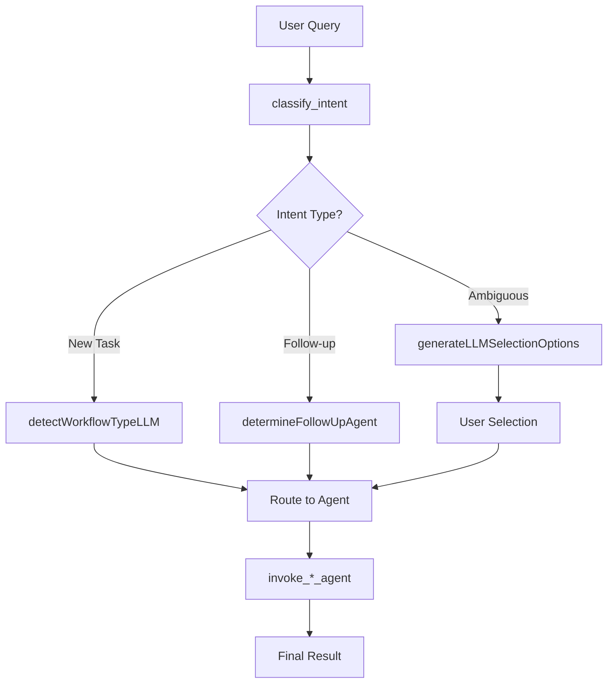

# 🔀 Router Agent - Intent Classification & Workflow Routing

## Overview

The Router Agent is the **entry point** for all user queries in the DHIS2 AI Suite. It acts as an intelligent traffic controller that:

1. **Classifies user intent** using LLM-based analysis
2. **Routes queries** to appropriate specialized agents
3. **Handles follow-up queries** with conversation context awareness
4. **Manages clarification** when intent is ambiguous

**File Location**: `src/agents/router-agent.ts`

## 🏗️ Architecture

The Router Agent uses a **StateGraph** architecture with the following key components:



### State Structure

```typescript
const RouterAnnotation = Annotation.Root({
    workflowType: Annotation<string>,      // 'analytics_routing', 'crud', 'data_entry', etc.
    originalQuery: Annotation<string>,     // Original user query
    dataEntryType: Annotation<'tracker' | 'aggregate' | null>, // For data entry routing
    orchestrator: Annotation<any>,         // Reference to WorkflowOrchestrator
    messages: Annotation<any[]>,          // Conversation messages
    finalResult: Annotation<any>          // Agent execution result
});
```

## 🔄 Workflow Nodes

### 1. `classify_intent` - Intent Classification

**Purpose**: Determines if query is new task, follow-up, or ambiguous

**Key Logic**:
1. **Strip file content** from query to prevent binary data in LLM calls
2. **Generate interpretations** using LLM classification service
3. **Check clarification needed** via clarification service
4. **Classify intent type** (new_task/follow_up/ambiguous)

**LLM Prompt Structure**:
```typescript
const intentClassificationPrompt = `
Analyze this user query and recent conversation context to determine the intent type.

Recent conversation context:
${recentMessages}

Current user query: "${query}"

Classify as: new_task | follow_up | ambiguous
`;
```

### 2. Agent Invocation Nodes

Each workflow type routes to a specialized agent:

- **`invoke_search_agent`** → Search Agent
- **`invoke_analytics_agent`** → Analytics Graph Agent
- **`invoke_crud_agent`** → CRUD Agent
- **`invoke_data_entry_router`** → Routed Data Entry Agent

### 3. `handle_clarification` - User Guidance

**Purpose**: Handle ambiguous queries requiring user clarification

**Process**:
1. Generate multiple interpretations via LLM
2. Present user-friendly selection options
3. Wait for user choice before proceeding

## 🎯 Intent Classification Logic

### New Task vs Follow-up Detection

The router uses sophisticated logic to distinguish between new tasks and follow-ups:

#### New Task Indicators
- No recent conversation context
- Explicit new operations ("Create...", "Find...", "Show...")
- No pronouns referencing previous work ("this", "that", "it")

#### Follow-up Indicators
- Recent agent results in conversation
- References to previous operations ("submit the data", "update that")
- Data grid context (review mode, validation states)
- Ordinals ("first", "last", "previous")

#### LLM-based Classification
```typescript
const intentClassification = await classifyIntentType(query, conversationHistory);
// Returns: { type: 'new_task' | 'follow_up' | 'ambiguous', confidence: number }
```

### Workflow Type Detection

For new tasks, determines the appropriate workflow type:

```typescript
const workflowType = await detectWorkflowTypeLLM(query, conversationHistory);
// Returns: 'direct_search' | 'analytics_routing' | 'crud' | 'data_entry' | 'unknown'
```

**Classification Categories**:
- **direct_search**: Finding existing metadata
- **analytics_routing**: Data analysis and visualization
- **crud**: Creating/modifying metadata structures
- **data_entry**: Entering data values into existing structures

## 🔀 Agent Routing Matrix

| Workflow Type | Agent | Description | Key Features |
|---------------|-------|-------------|--------------|
| `direct_search` | Search Agent | Metadata discovery | LLM tool selection |
| `analytics_routing` | Analytics Agent | Data visualization | StateGraph workflow |
| `crud` | CRUD Agent | Metadata operations | Tool-based execution |
| `data_entry` | Data Entry Router | Data value entry | Tracker vs Aggregate |

## 📋 Data Entry Type Detection

For data entry workflows, the router determines whether to route to **tracker** or **aggregate** processing:

### Tracker Indicators
- Review mode data grids
- Patient data references
- Entity attribute mappings
- "Save to DHIS2" operations

### Aggregate Indicators
- CSV data grids
- Header-based data structure
- Dataset references
- Standard data value entry

## 🔄 Conversation Context Integration

### Context-Aware Routing
- **Recent Results**: Checks for recent agent execution results
- **Data Grid State**: Examines current data grid context (review mode, validation state)
- **Session History**: Analyzes conversation threading for follow-up detection

### File Content Handling
- **Binary Data Protection**: Strips file content from LLM queries
- **File References**: Converts binary content to file registry references
- **Secure Processing**: Prevents sensitive data exposure in AI calls

## 🚨 Error Handling & Recovery

### Classification Failures
- **Fallback Logic**: Keyword-based classification when LLM fails
- **Ambiguous Intent**: User selection interface for unclear queries
- **Clarification Service**: Intelligent ambiguity detection

### Agent Invocation Errors
- **Error Propagation**: Passes errors through finalResult
- **Context Preservation**: Maintains conversation context on failures
- **Recovery Options**: Provides user guidance for resolution

## 🔧 Key Functions

### `stripFileContent(query: string)`
Removes binary file content from queries before LLM processing:
```typescript
const fileContentPattern = /File:\s*[^\n]+\nContent:\n[\s\S]*$/;
return query.replace(fileContentPattern, '').trim();
```

### `generateIntentInterpretations(query: string)`
Creates multiple possible interpretations for clarification:
```typescript
const interpretations = await llmClassificationService.classifyIntent(query);
// Returns: Interpretation[] with confidence scores
```

### `detectWorkflowTypeLLM(query: string, context: any[])`
LLM-powered workflow type classification with conversation context.

### `determineFollowUpAgent(query: string, history: any[], intent: any)`
Intelligently routes follow-up queries based on conversation context.

## 📊 Performance Considerations

### LLM Call Optimization
- **Context Limiting**: Restricts conversation history to recent messages
- **Caching**: Avoids redundant classifications for similar queries
- **Batch Processing**: Groups related interpretations

### Memory Management
- **State Cleanup**: Clears completed workflow state
- **Reference Management**: Proper cleanup of orchestrator references
- **Session Boundaries**: Resets context for new chat sessions

## 🔌 Integration Points

### Workflow Orchestrator
- **UI State Management**: Receives orchestrator reference for UI coordination
- **Progress Updates**: Reports routing decisions to orchestrator
- **Conversation Integration**: Adds routing decisions to conversation thread

### Conversation Context
- **Context Queries**: Accesses conversation history for intelligent routing
- **Result Storage**: Stores routing decisions and agent results
- **Session Management**: Handles conversation session boundaries

### Clarification Service
- **Ambiguity Detection**: Determines when user clarification is needed
- **Option Generation**: Creates user-friendly selection options
- **Guidance Provision**: Provides contextual help for unclear queries

## 🎯 Usage Examples

### Simple Routing
```
Query: "Create a new data element"
→ classify_intent → workflowType: 'crud' → invoke_crud_agent
```

### Follow-up Detection
```
Previous: Data grid with validation errors
Query: "Submit the corrected data"
→ classify_intent → workflowType: 'data_entry' → dataEntryType: 'aggregate'
```

### Ambiguous Query
```
Query: "Handle this data"
→ classify_intent → clarification_needed → User selection → Route based on choice
```

## 🔍 Debugging & Monitoring

### Key Logging Points
- Intent classification results with confidence scores
- Workflow type detection outcomes
- Agent routing decisions
- Clarification service interactions

### Common Issues
- **Over-classification**: Ambiguous queries routed incorrectly
- **Context Loss**: Follow-up queries not properly linked to previous operations
- **LLM Failures**: Fallback logic handles classification service outages

## 🚀 Extension Points

### Adding New Workflow Types
1. Add new workflow type to classification logic
2. Create corresponding `invoke_*_agent` function
3. Add routing edge in StateGraph
4. Update agent routing matrix

### Enhancing Classification
- Add new intent patterns to LLM prompts
- Extend follow-up detection logic
- Improve multilingual support
- Add domain-specific routing rules

---

The Router Agent serves as the intelligent gateway to the DHIS2 AI Suite, ensuring queries are efficiently routed to the most appropriate specialized agent while maintaining conversation context and providing user guidance when needed.
