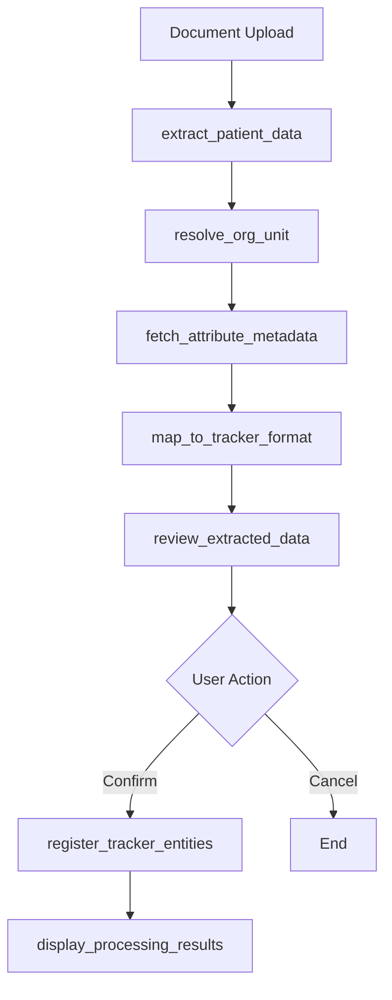

# 🏥 Tracker Agent - Patient Data Processing & Entity Management

## Overview

The Tracker Agent is a comprehensive StateGraph-based workflow for processing patient-level data from scanned documents, managing DHIS2 tracker entities, and providing interactive data review capabilities. It handles the complete pipeline from document upload through OCR processing to DHIS2 entity registration.

**File Location**: `src/agents/tracker-agent.ts`

**Architecture**: LangGraph StateGraph with 8+ workflow nodes and interactive review capabilities

## 🏗️ Core Architecture

### StateGraph Workflow


### State Annotation
Comprehensive state management for complex tracker workflows:

```typescript
const TrackerDataAnnotation = Annotation.Root({
    // Document processing
    uploadedDocument: Annotation<DocumentData>,
    extractedPatients: Annotation<ExtractedPatientData[]>,

    // Metadata resolution
    resolvedOrgUnit: Annotation<OrgUnit>,
    attributeMetadata: Annotation<Record<string, AttributeInfo>>,

    // Data transformation
    mappedTrackerData: Annotation<TrackerDataValue[]>,

    // Configuration
    orgUnit: Annotation<string>,
    programId: Annotation<string>,
    attributeMappings: Annotation<Record<string, string>>,

    // UI interaction state
    showReviewGrid: Annotation<boolean>,
    userConfirmedSave: Annotation<boolean>,
    editingMode: Annotation<boolean>,

    // Workflow control
    uiAction: Annotation<string>,
    finalResult: Annotation<any>
});
```

## 🔄 Workflow Nodes

### 1. `handle_document_upload` - Document Intake

**Purpose**: Process uploaded documents and validate file requirements

**Key Logic**:
- **File Retrieval**: Get file from orchestrator's current file registry
- **Format Validation**: Ensure file is PDF/image format
- **Size Limits**: Check file size constraints (10MB max)
- **Fallback Methods**: Multiple file reference detection strategies

**Supported Formats**: PDF, PNG, JPG, JPEG

### 2. `extract_patient_data` - OCR Processing

**Purpose**: Extract structured patient data using Azure Document Intelligence

**Azure Document Intelligence Integration**:
```typescript
const extractionResult = await processScannedRegister.invoke({
    fileBuffer: state.uploadedDocument.buffer,
    filename: state.uploadedDocument.filename
});
```

**Output Format**:
```typescript
{
    patients: [
        {
            "name": { value: "John Doe", confidence: 0.95 },
            "age": { value: "25", confidence: 0.98 },
            "diagnosis": { value: "Malaria", confidence: 0.87 }
        }
    ],
    extractedOrgUnit: "District Hospital A"
}
```

### 3. `resolve_org_unit` - Geographic Resolution

**Purpose**: Match extracted organization unit names to DHIS2 org units

**Resolution Strategy**:
1. **Auto-resolution**: Single exact match found
2. **User Selection**: Multiple matches → interactive selection
3. **Default Fallback**: No match found → use system default

**Interactive Selection**:
```typescript
return {
    type: 'select_org_unit',
    selectionOptions: orgUnits.map(ou => ({
        id: ou.id, name: ou.name, type: 'organisationUnit'
    })),
    allowMultiple: false
};
```

### 4. `fetch_attribute_metadata` - Dynamic Input Configuration

**Purpose**: Retrieve attribute metadata for dynamic form generation

**Metadata Retrieval**:
```typescript
const attributeMetadata = {
    [attributeId]: {
        valueType: 'TEXT' | 'NUMBER' | 'DATE',
        mandatory: boolean,
        unique: boolean,
        optionSet: {
            id: string,
            name: string,
            options: [{ id: string, name: string }]
        }
    }
};
```

**Use Cases**:
- **Dynamic Forms**: Generate appropriate input types (text, number, dropdown)
- **Validation Rules**: Apply mandatory/unique constraints
- **Option Sets**: Populate dropdowns with valid values

### 5. `map_to_tracker_format` - Data Transformation

**Purpose**: Convert extracted data to DHIS2 tracker entity format

**LLM-Powered Header Matching**:
```typescript
const llmMatchingResult = await matchPdfHeadersToMapping.invoke({
    pdfHeaders: headers,
    programId: programId,
    confidenceThreshold: 0.7
});
```

**DHIS2 Tracker Format**:
```typescript
{
    trackedEntityInstance: "tei-uuid",
    program: "program-id",
    orgUnit: "orgunit-id",
    enrollmentDate: "2024-01-01",
    attributes: [
        { attribute: "attr-id", value: "John Doe" },
        { attribute: "attr-id", value: "25" }
    ]
}
```

### 6. `review_extracted_data` - Interactive Review

**Purpose**: Present extracted data for user validation before saving

**Review Interface**:
```typescript
return {
    type: 'show_review_grid',
    data: {
        extractedPatients: patients,
        mappedTrackerData: entities,
        headerMappings: mappings,
        reviewMode: true,
        actions: ['confirm_save', 'cancel_save']
    },
    requiresUserAction: true
};
```

**Workflow Pause**: Process stops for user interaction, resumes on confirmation

### 7. `register_tracker_entities` - DHIS2 Integration

**Purpose**: Register tracker entities in DHIS2 database

**API Integration**:
```typescript
const registrationResult = await registerTrackerEntities.invoke({
    trackerPayload: { trackedEntities: entities },
    importStrategy: 'CREATE_AND_UPDATE'
});
```

**Result Processing**:
```typescript
{
    success: true,
    message: "Successfully processed 25 patient records",
    details: {
        totalPatients: 25,
        successful: 23,
        failed: 2,
        results: [...]
    }
}
```

## 🎯 Interactive Capabilities

### UI Interaction Handling

The agent supports complex user interactions through `handleUIInteraction`:

#### **Save Confirmation**
```typescript
case 'confirm_save':
    // Direct registration with detailed feedback
    const result = await register_tracker_entities(state);
    return {
        finalResult: {
            success: true,
            message: `✅ Successfully registered ${successful} entities`,
            details: { total, successful, failed }
        }
    };
```

#### **Organization Unit Selection**
```typescript
case 'select_org_unit':
    // Update state with selected org unit
    updatedState.resolvedOrgUnit = {
        id: selected.id,
        name: selected.name
    };
    // Continue workflow
```

#### **Entity Operations**
- **Update Attributes**: Modify existing entity data
- **Delete Entities**: Remove tracker instances
- **View Details**: Display entity information

## 🚨 Error Recovery System

### Recovery Strategies

#### **Document Processing Recovery**
```typescript
recoveryOptions: [
    {
        id: 'manual_entry',
        label: 'Enter data manually',
        description: 'Switch to manual data entry instead of document processing'
    },
    {
        id: 'upload_again',
        label: 'Upload different file',
        description: 'Upload a clearer or different document'
    }
]
```

#### **Header Matching Recovery**
```typescript
recoveryOptions: [
    {
        id: 'manual_mapping',
        label: 'Map columns manually',
        description: 'Select which document columns correspond to DHIS2 attributes'
    },
    {
        id: 'use_defaults',
        label: 'Use default mappings',
        description: 'Continue with automatic attribute detection'
    }
]
```

#### **Validation Recovery**
```typescript
recoveryOptions: [
    {
        id: 'fix_validation_errors',
        label: 'Review and fix errors',
        description: 'Review validation errors and correct them manually'
    },
    {
        id: 'save_valid_only',
        label: 'Save valid records only',
        description: 'Save only the records that passed validation'
    }
]
```

## 🔄 Orchestrator Integration

### File Handling
- **Registry Integration**: Access to orchestrator's file registry
- **Reference Resolution**: Multiple fallback methods for file retrieval
- **Secure Processing**: Binary data handling without LLM exposure

### Progress Tracking
```typescript
state.orchestrator?.addProgressMessage('Extracting patient data from document...');
```

### Conversation Context
All operations stored for follow-up queries and context awareness.

## 📊 Data Flow Architecture

### Processing Pipeline
```
Document Upload → OCR Processing → Data Extraction → Org Unit Resolution → Attribute Mapping → Data Transformation → Review → Registration → Results
     ↓              ↓              ↓                  ↓                  ↓                 ↓            ↓          ↓          ↓
File Registry   Azure DI       Structured Data   Search API       Metadata API    LLM Mapping   UI Review   DHIS2 API  User Feedback
```

### State Transitions
- **Linear Processing**: Document → OCR → Mapping → Review
- **Interactive Pauses**: User selections and confirmations
- **Error Recovery**: Branching to recovery workflows
- **Completion Paths**: Success/failure with detailed results

## 🎯 Usage Examples

### Complete Document Processing
```
1. User uploads scanned patient register (PDF)
2. Agent extracts patient data via Azure Document Intelligence
3. Agent resolves organization unit from extracted text
4. Agent fetches attribute metadata for dynamic form generation
5. Agent maps extracted data to DHIS2 tracker format
6. Agent presents review grid for user validation
7. User confirms save → Agent registers entities in DHIS2
8. Agent provides detailed success/failure feedback
```

### Interactive Org Unit Selection
```
Agent: "Found 3 organization units matching 'District Hospital'. Please select:"
User: Selects appropriate org unit
Agent: Continues with selected org unit for data mapping
```

### Error Recovery
```
Agent: "Document processing failed due to poor image quality"
Recovery Options:
- Upload clearer document
- Switch to manual data entry
- Retry processing
```

## 🔍 Debugging & Monitoring

### Key Logging Points
- File upload success/failure and metadata
- OCR extraction results and confidence scores
- Org unit resolution attempts and outcomes
- Attribute mapping success/failure
- DHIS2 API registration results

### Common Issues
- **OCR Quality**: Poor document quality affecting extraction
- **Org Unit Resolution**: Ambiguous or missing location information
- **Attribute Mapping**: Header mismatch between document and DHIS2
- **API Limits**: DHIS2 rate limiting during bulk registration

## 🚀 Extension Points

### Additional Document Types
- Support for Excel/CSV patient registers
- Multi-page document processing
- Batch document processing
- Different OCR providers integration

### Enhanced Validation
- Cross-field validation rules
- Duplicate detection
- Data quality scoring
- Automated error correction

### Advanced Workflows
- Incremental data updates
- Historical data migration
- Bulk entity operations
- Audit trail generation

---

The Tracker Agent represents a sophisticated document processing and entity management system, combining OCR technology, intelligent data mapping, interactive user workflows, and robust DHIS2 integration to enable efficient patient data digitization and management.
