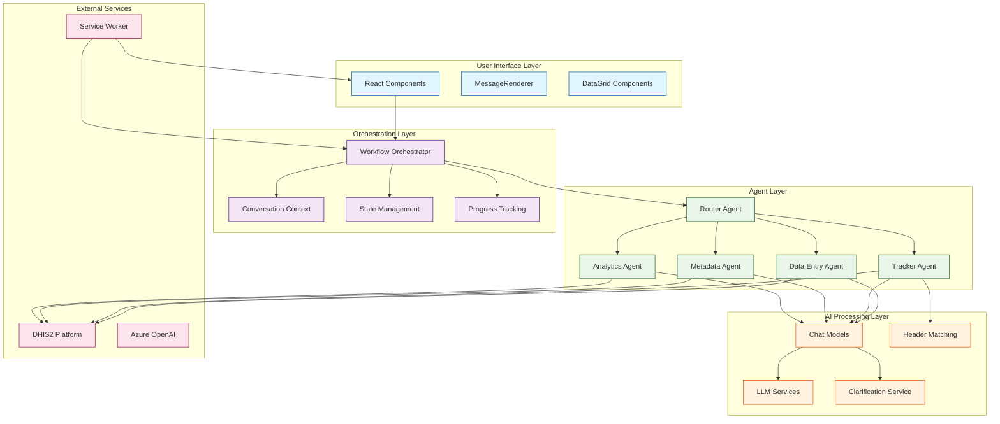
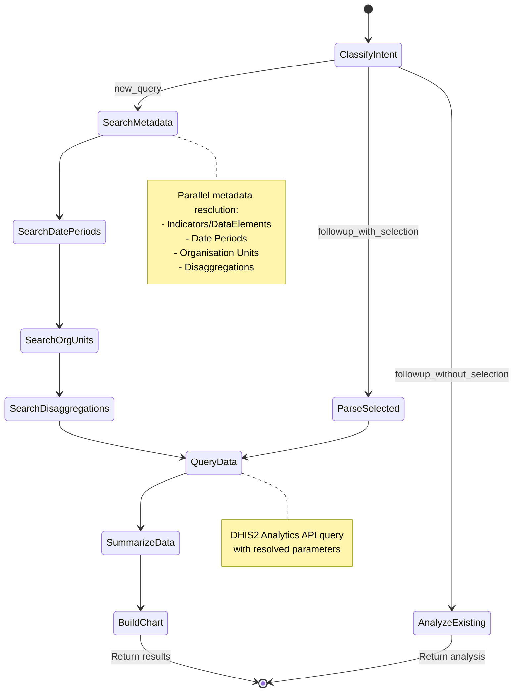
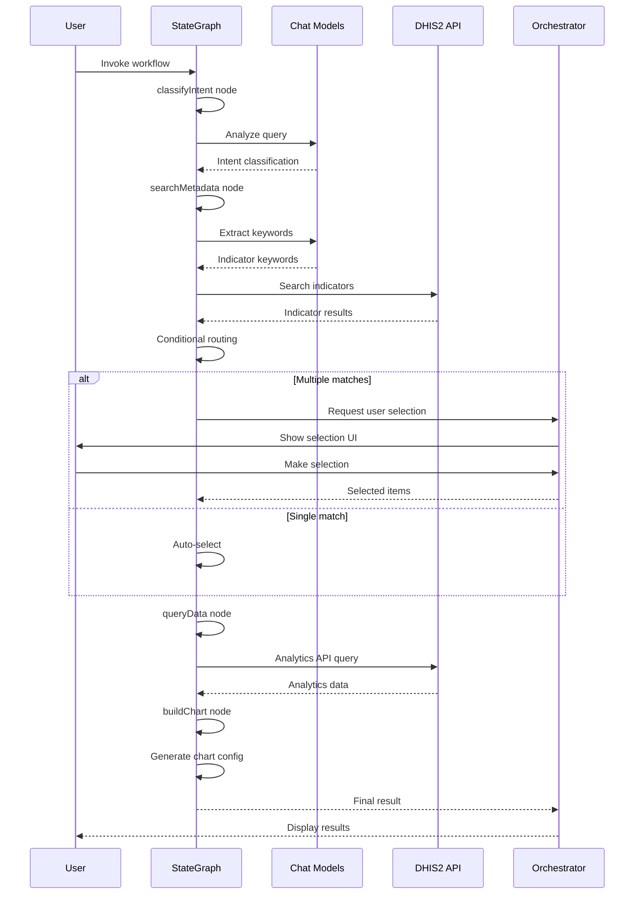
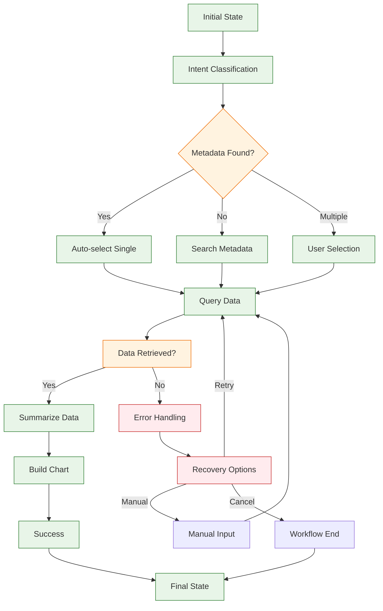

# 🔬 Architecture Deep Dive - LangChain/LangGraph Integration

## Overview

This document provides an in-depth exploration of the LangChain and LangGraph integration patterns used throughout the DHIS2 AI Suite. It covers the browser-compatible LangGraph implementation, StateGraph workflow architectures, advanced state management patterns, and component interaction flows that enable sophisticated conversational AI capabilities.

**File Location**: `src/utils/state.ts`, various agent implementations

**Key Technologies**:
- `@langchain/langgraph/web` - Browser-compatible LangGraph
- `@langchain/langgraph/prebuilt` - Prebuilt agent components
- `@langchain/core` - Core LangChain abstractions
- Custom StateAnnotation patterns

---

## 🏗️ **LangChain/LangGraph Integration Patterns**

### Browser-Compatible LangGraph Architecture

#### Core Import Structure
```typescript
import {
    Annotation,      // State definition and typing
    END, START,      // Workflow control nodes
    StateGraph       // Main workflow orchestration
} from '@langchain/langgraph/web';

import {
    createReactAgent  // Prebuilt agent creation
} from '@langchain/langgraph/prebuilt';

import {
    HumanMessage,     // Message types
    SystemMessage,
    AIMessage
} from '@langchain/core/messages';
```

#### Browser Compatibility Design
The `@langchain/langgraph/web` package is specifically designed for browser environments:

```typescript
// Browser-optimized StateGraph compilation
const workflow = new StateGraph(StateAnnotation)
    .addNode('process_input', processInputNode)
    .addNode('generate_response', generateResponseNode)
    .addConditionalEdges('process_input', routingFunction)
    .compile();

// Browser-compatible execution
const result = await workflow.invoke({
    messages: [new HumanMessage(userInput)]
});
```

**Key Browser Optimizations:**
- No Node.js dependencies (file system, process, etc.)
- WebAssembly-based computations where applicable
- Chunked processing for large datasets
- IndexedDB integration for state persistence
- Service Worker compatibility

### StateAnnotation Patterns

#### Basic StateAnnotation Structure
```typescript
const BasicAnnotation = Annotation.Root({
    // Message history with reducer
    messages: Annotation<any[]>({
        reducer: (left: any[], right: any[]) => right ? right : left,
        default: () => []
    }),

    // Workflow state
    currentStep: Annotation<string>({
        reducer: (left, right) => right || left,
        default: () => 'initial'
    }),

    // Result state
    result: Annotation<any>({
        reducer: (left, right) => right || left,
        default: () => null
    })
});
```

#### Advanced StateAnnotation with Complex Reducers
```typescript
const AnalyticsAnnotation = Annotation.Root({
    // Complex state with custom reducers
    metadata: Annotation<any>({
        reducer: (left, right) => right ? { ...left, ...right } : left,
        default: () => ({ status: 'pending', suggestions: [] })
    }),

    // Progress tracking state
    workflowProgress: Annotation<ProgressState>({
        reducer: (left, right) => right || left,
        default: () => ({
            currentStep: 0,
            totalSteps: 8,
            stepName: 'Initializing'
        })
    }),

    // Orchestrator integration
    orchestrator: Annotation<any>({
        reducer: (left, right) => right || left,
        default: () => null
    })
});
```

#### Reducer Function Patterns

##### Message Accumulation Reducer
```typescript
const messageReducer = (left: any[], right: any[]) => {
    if (Array.isArray(right)) {
        // Handle array of messages
        return left.concat(right);
    } else if (right) {
        // Handle single message
        return left.concat([right]);
    }
    return left;
};
```

##### State Merging Reducer
```typescript
const mergeReducer = (left: Record<string, any>, right: Record<string, any>) => {
    if (!right) return left;
    return { ...left, ...right };
};
```

##### Latest Value Override
```typescript
const overrideReducer = (left: any, right: any) => right || left;
```

##### Conditional Update Reducer
```typescript
const conditionalReducer = (left: any, right: any) => {
    // Only update if right has meaningful value
    if (right === null || right === undefined) return left;
    if (typeof right === 'object' && Object.keys(right).length === 0) return left;
    return right;
};
```

---

## 🔄 **StateGraph Workflow Architecture**

### Core StateGraph Components

#### Node Definition Pattern
```typescript
// Async node function signature
async function processNode(state: typeof StateAnnotation.State): Promise<Partial<typeof StateAnnotation.State>> {
    console.log('🔄 Processing node with state:', state);

    // Process state and return updates
    const result = await performOperation(state);

    return {
        currentStep: 'processed',
        result: result,
        // Other state updates...
    };
}
```

#### Conditional Routing Logic
```typescript
function routeBasedOnState(state: typeof StateAnnotation.State) {
    // Decision-based routing
    if (state.result?.success) {
        return 'success_handler';
    }

    if (state.result?.requiresUserInput) {
        return 'user_interaction';
    }

    if (state.error) {
        return 'error_handler';
    }

    return 'default_handler';
}
```

#### Complex Multi-Branch Routing
```typescript
function advancedRouting(state: typeof StateAnnotation.State) {
    const { currentStep, result, error, userSelections } = state;

    // Phase 1: Initial processing
    if (currentStep === 'initial') {
        return result?.data ? 'data_processing' : 'data_collection';
    }

    // Phase 2: User interaction handling
    if (currentStep === 'waiting_for_input') {
        return userSelections?.length > 0 ? 'process_selections' : 'retry_input';
    }

    // Phase 3: Error recovery
    if (error) {
        return error.recoverable ? 'recovery_attempt' : 'fatal_error';
    }

    // Phase 4: Completion
    return result?.complete ? END : 'continue_processing';
}
```

### StateGraph Compilation and Execution

#### Workflow Compilation
```typescript
const workflow = new StateGraph(StateAnnotation)
    // Add processing nodes
    .addNode('initialize', initializeNode)
    .addNode('process_data', processDataNode)
    .addNode('validate_results', validateResultsNode)
    .addNode('finalize', finalizeNode)

    // Add error handling nodes
    .addNode('handle_error', handleErrorNode)
    .addNode('recovery_attempt', recoveryAttemptNode)

    // Define workflow flow
    .addEdge(START, 'initialize')
    .addEdge('initialize', 'process_data')
    .addConditionalEdges('process_data', routeAfterProcessing)
    .addEdge('validate_results', 'finalize')
    .addEdge('finalize', END)

    // Error handling edges
    .addEdge('handle_error', 'recovery_attempt')
    .addConditionalEdges('recovery_attempt', routeAfterRecovery)
    .compile();
```

#### Workflow Execution Patterns

##### Standard Execution
```typescript
const result = await workflow.invoke({
    messages: [new HumanMessage(userQuery)],
    currentStep: 'initial',
    orchestrator: orchestratorInstance
});
```

##### Streaming Execution (for real-time updates)
```typescript
const stream = await workflow.stream({
    messages: [new HumanMessage(userQuery)]
});

for await (const update of stream) {
    // Handle real-time state updates
    handleStateUpdate(update);
}
```

##### Checkpoint-Based Execution
```typescript
// Resume from checkpoint
const result = await workflow.invoke(null, {
    configurable: {
        checkpoint_id: savedCheckpointId
    }
});
```

---

## 🌐 **Browser-Compatible LangGraph Usage**

### Web-Specific Optimizations

#### Memory Management
```typescript
// Progressive state cleanup
const ProgressiveStateAnnotation = Annotation.Root({
    // Large data with automatic cleanup
    largeDataset: Annotation<any[]>({
        reducer: (left, right) => {
            // Limit array size for browser memory
            const combined = left.concat(right || []);
            return combined.slice(-MAX_ITEMS); // Keep only recent items
        },
        default: () => []
    }),

    // Lazy-loaded state
    lazyData: Annotation<any>({
        reducer: async (left, right) => {
            if (right === 'LOAD_REQUESTED') {
                return await loadDataFromIndexedDB();
            }
            return right || left;
        }
    })
});
```

#### IndexedDB Integration
```typescript
// Persistent state storage for browser
const PersistentAnnotation = Annotation.Root({
    // Auto-persist to IndexedDB
    persistentData: Annotation<any>({
        reducer: (left, right) => {
            const updated = right || left;
            if (updated) {
                saveToIndexedDB('workflow_state', updated);
            }
            return updated;
        }
    }),

    // Cached computations
    computedCache: Annotation<Map<string, any>>({
        reducer: (left, right) => right || left,
        default: () => new Map()
    })
});
```

#### Service Worker Compatibility
```typescript
// Service worker-aware state management
const ServiceWorkerAnnotation = Annotation.Root({
    // State that syncs with service worker
    swState: Annotation<any>({
        reducer: (left, right) => {
            const updated = right || left;
            if ('serviceWorker' in navigator) {
                navigator.serviceWorker.controller?.postMessage({
                    type: 'STATE_UPDATE',
                    state: updated
                });
            }
            return updated;
        }
    }),

    // Offline-capable state
    offlineData: Annotation<any>({
        reducer: (left, right) => {
            const updated = right || left;
            // Store for offline access
            localforage.setItem('offline_state', updated);
            return updated;
        }
    })
});
```

### Browser-Specific Error Handling

#### Network Error Recovery
```typescript
async function handleNetworkError(state, error) {
    // Check if offline
    if (!navigator.onLine) {
        return {
            error: 'Network unavailable - operating in offline mode',
            offlineMode: true,
            cachedData: await getCachedData()
        };
    }

    // Retry with exponential backoff
    const retryResult = await retryWithBackoff(
        () => performNetworkOperation(),
        { maxRetries: 3, baseDelay: 1000 }
    );

    return retryResult;
}
```

#### Memory Constraint Handling
```typescript
async function handleMemoryConstraints(state) {
    // Check memory usage
    if ('memory' in performance) {
        const memInfo = (performance as any).memory;
        const usedPercent = (memInfo.usedJSHeapSize / memInfo.totalJSHeapSize) * 100;

        if (usedPercent > 80) {
            // Trigger cleanup
            await cleanupMemory();
            return {
                memoryOptimized: true,
                cleanupPerformed: true
            };
        }
    }

    return { memoryOptimized: false };
}
```

---

## 🧩 **Component Interaction Diagrams**

### System Component Communication Flow



### Agent StateGraph Workflow Example



### Data Flow Through StateGraph Nodes



### State Transition Flow



---

## 🔧 **Advanced StateGraph Patterns**

### Hierarchical State Machines

#### Parent-Child Workflow Pattern
```typescript
// Parent workflow manages child workflows
const ParentAnnotation = Annotation.Root({
    childWorkflows: Annotation<ChildWorkflowState[]>({
        reducer: (left, right) => right || left,
        default: () => []
    }),
    overallProgress: Annotation<number>({
        reducer: (left, right) => right || left,
        default: () => 0
    })
});

// Child workflow for specific operations
const ChildAnnotation = Annotation.Root({
    operationData: Annotation<any>({
        reducer: (left, right) => right || left
    }),
    childResult: Annotation<any>({
        reducer: (left, right) => right || left
    })
});
```

#### Parallel Execution Pattern
```typescript
// Parallel node execution
const ParallelAnnotation = Annotation.Root({
    parallelTasks: Annotation<any[]>({
        reducer: (left, right) => right || left,
        default: () => []
    }),
    completedTasks: Annotation<number>({
        reducer: (left, right) => (right || 0) + (left || 0),
        default: () => 0
    })
});

// Parallel execution node
async function executeParallelTasks(state) {
    const tasks = state.parallelTasks || [];
    const results = await Promise.allSettled(
        tasks.map(task => executeTask(task))
    );

    return {
        taskResults: results,
        completedTasks: results.length
    };
}
```

### Event-Driven State Updates

#### Event Subscription Pattern
```typescript
const EventDrivenAnnotation = Annotation.Root({
    eventSubscriptions: Annotation<Map<string, Function>>({
        reducer: (left, right) => {
            const updated = new Map(left);
            if (right) {
                Object.entries(right).forEach(([event, handler]) => {
                    updated.set(event, handler);
                });
            }
            return updated;
        },
        default: () => new Map()
    }),

    pendingEvents: Annotation<any[]>({
        reducer: (left, right) => left.concat(right || []),
        default: () => []
    })
});
```

#### Event Processing Node
```typescript
async function processEvents(state) {
    const subscriptions = state.eventSubscriptions;
    const pendingEvents = state.pendingEvents || [];

    const results = [];
    for (const event of pendingEvents) {
        const handler = subscriptions.get(event.type);
        if (handler) {
            const result = await handler(event);
            results.push(result);
        }
    }

    return {
        eventResults: results,
        processedEvents: pendingEvents.length
    };
}
```

### State Persistence and Recovery

#### Checkpoint Pattern
```typescript
const CheckpointAnnotation = Annotation.Root({
    checkpoints: Annotation<Map<string, Checkpoint>>({
        reducer: (left, right) => {
            const updated = new Map(left);
            if (right) {
                updated.set(right.id, right);
            }
            return updated;
        },
        default: () => new Map()
    }),

    lastCheckpoint: Annotation<string>({
        reducer: (left, right) => right || left,
        default: () => ''
    })
});

// Checkpoint creation
async function createCheckpoint(state, checkpointId) {
    const checkpoint = {
        id: checkpointId,
        timestamp: Date.now(),
        state: { ...state },
        progress: state.workflowProgress
    };

    // Persist to storage
    await saveCheckpointToStorage(checkpoint);

    return {
        lastCheckpoint: checkpointId,
        checkpoints: { [checkpointId]: checkpoint }
    };
}
```

### Error Handling and Recovery

#### Error-Aware StateGraph
```typescript
const ResilientAnnotation = Annotation.Root({
    // Normal operation state
    operationState: Annotation<any>({
        reducer: (left, right) => right || left
    }),

    // Error tracking
    errors: Annotation<any[]>({
        reducer: (left, right) => left.concat(right || []),
        default: () => []
    }),

    // Recovery state
    recoveryAttempts: Annotation<number>({
        reducer: (left, right) => (left || 0) + (right || 0),
        default: () => 0
    }),

    // Recovery strategies
    recoveryStrategies: Annotation<any[]>({
        reducer: (left, right) => right || left,
        default: () => []
    })
});
```

#### Error Recovery Node
```typescript
async function handleErrors(state) {
    const errors = state.errors || [];
    if (errors.length === 0) return {};

    const latestError = errors[errors.length - 1];
    const recoveryAttempts = state.recoveryAttempts || 0;

    // Generate recovery strategies
    const strategies = await generateRecoveryStrategies(latestError, recoveryAttempts);

    return {
        recoveryStrategies: strategies,
        recoveryAttempts: recoveryAttempts + 1,
        uiAction: 'show_recovery_options'
    };
}
```

---

## 📊 **Performance Optimization Patterns**

### Memory-Efficient State Management

#### State Chunking
```typescript
const ChunkedAnnotation = Annotation.Root({
    // Large data in chunks
    dataChunks: Annotation<any[][]>({
        reducer: (left, right) => {
            if (right) {
                return left.concat([right]);
            }
            return left;
        },
        default: () => []
    }),

    // Active chunk index
    activeChunk: Annotation<number>({
        reducer: (left, right) => right ?? left,
        default: () => 0
    }),

    // Chunk size limit
    maxChunkSize: Annotation<number>({
        reducer: (left, right) => right ?? left,
        default: () => 1000
    })
});
```

#### Lazy State Loading
```typescript
const LazyAnnotation = Annotation.Root({
    // Lazy-loaded state
    lazyState: Annotation<any>({
        reducer: async (left, right) => {
            if (right === 'LOAD_REQUESTED') {
                return await loadStateFromStorage();
            }
            return right || left;
        }
    }),

    // Loading state
    isLoading: Annotation<boolean>({
        reducer: (left, right) => right ?? left,
        default: () => false
    })
});
```

### Concurrent Processing

#### Parallel Node Execution
```typescript
// Parallel processing workflow
const parallelWorkflow = new StateGraph(ParallelAnnotation)
    .addNode('split_work', splitWorkNode)
    .addNode('process_parallel', processParallelNode)
    .addNode('combine_results', combineResultsNode)
    .addEdge(START, 'split_work')
    .addEdge('split_work', 'process_parallel')
    .addEdge('process_parallel', 'combine_results')
    .addEdge('combine_results', END)
    .compile();

// Parallel processing node
async function processParallelNode(state) {
    const tasks = state.parallelTasks || [];
    const batchSize = 3; // Process 3 tasks concurrently

    const results = [];
    for (let i = 0; i < tasks.length; i += batchSize) {
        const batch = tasks.slice(i, i + batchSize);
        const batchResults = await Promise.allSettled(
            batch.map(task => processTask(task))
        );
        results.push(...batchResults);
    }

    return { parallelResults: results };
}
```

---

## 🔍 **Debugging and Monitoring**

### State Inspection Tools

#### State Logging Middleware
```typescript
function createStateLogger(workflow) {
    return new Proxy(workflow, {
        get(target, prop) {
            if (prop === 'invoke') {
                return async function(...args) {
                    console.log('🔄 Workflow invoked with:', args[0]);
                    const result = await target.invoke(...args);
                    console.log('✅ Workflow completed with:', result);
                    return result;
                };
            }
            return target[prop];
        }
    });
}
```

#### State Validation
```typescript
function validateState(state) {
    const requiredFields = ['messages', 'currentStep'];
    const missingFields = requiredFields.filter(field => !(field in state));

    if (missingFields.length > 0) {
        throw new Error(`Invalid state: missing fields ${missingFields.join(', ')}`);
    }

    return true;
}
```

### Performance Monitoring

#### Execution Time Tracking
```typescript
const PerformanceAnnotation = Annotation.Root({
    executionTimes: Annotation<Map<string, number>>({
        reducer: (left, right) => {
            const updated = new Map(left);
            if (right) {
                Object.entries(right).forEach(([node, time]) => {
                    updated.set(node, time);
                });
            }
            return updated;
        },
        default: () => new Map()
    }),

    totalExecutionTime: Annotation<number>({
        reducer: (left, right) => (left || 0) + (right || 0),
        default: () => 0
    })
});
```

#### Performance Monitoring Node
```typescript
async function monitorPerformance(state, nodeName, nodeFn) {
    const startTime = performance.now();
    const result = await nodeFn(state);
    const executionTime = performance.now() - startTime;

    return {
        ...result,
        executionTimes: { [nodeName]: executionTime },
        totalExecutionTime: executionTime
    };
}
```

---

## 🚀 **Extension Patterns**

### Custom StateAnnotation Creation

#### Domain-Specific Annotations
```typescript
function createDomainAnnotation(domainConfig) {
    return Annotation.Root({
        // Standard fields
        messages: Annotation<any[]>({
            reducer: messageReducer,
            default: () => []
        }),

        // Domain-specific fields
        domainData: Annotation<any>({
            reducer: (left, right) => ({ ...left, ...right }),
            default: () => ({})
        }),

        // Configurable fields based on domain
        ...domainConfig.fields
    });
}
```

### Dynamic Workflow Creation

#### Workflow Factory Pattern
```typescript
function createWorkflowFromConfig(config) {
    const annotation = createDomainAnnotation(config);

    const workflow = new StateGraph(annotation);

    // Add nodes from config
    config.nodes.forEach(nodeConfig => {
        workflow.addNode(nodeConfig.id, nodeConfig.handler);
    });

    // Add edges from config
    config.edges.forEach(edgeConfig => {
        if (edgeConfig.condition) {
            workflow.addConditionalEdges(edgeConfig.from, edgeConfig.condition);
        } else {
            workflow.addEdge(edgeConfig.from, edgeConfig.to);
        }
    });

    return workflow.compile();
}
```

### Plugin System Integration

#### Extensible StateGraph
```typescript
class ExtensibleStateGraph {
    constructor(baseAnnotation) {
        this.annotation = baseAnnotation;
        this.plugins = new Map();
        this.nodes = new Map();
    }

    registerPlugin(name, plugin) {
        this.plugins.set(name, plugin);
        // Extend annotation with plugin fields
        this.annotation = Annotation.Root({
            ...this.annotation.State,
            ...plugin.annotationFields
        });
    }

    addNode(name, handler) {
        // Apply plugins to node handler
        let enhancedHandler = handler;
        for (const plugin of this.plugins.values()) {
            if (plugin.enhanceNode) {
                enhancedHandler = plugin.enhanceNode(enhancedHandler);
            }
        }

        this.nodes.set(name, enhancedHandler);
    }

    compile() {
        const workflow = new StateGraph(this.annotation);

        // Add nodes with plugin enhancements
        for (const [name, handler] of this.nodes) {
            workflow.addNode(name, handler);
        }

        // Apply plugin workflow modifications
        for (const plugin of this.plugins.values()) {
            if (plugin.modifyWorkflow) {
                plugin.modifyWorkflow(workflow);
            }
        }

        return workflow.compile();
    }
}
```

---

This architecture deep dive demonstrates the sophisticated LangChain/LangGraph integration that powers the DHIS2 AI Suite's conversational AI capabilities. The browser-compatible implementation, advanced StateAnnotation patterns, and complex StateGraph workflows enable robust, scalable, and maintainable AI-powered workflows for health data management.
