# 🏗️ DHIS2 AI Suite - System Architecture

## Overview

The DHIS2 AI Suite is a sophisticated conversational AI platform designed for health data management and analytics. This document provides a comprehensive architectural overview of the system's components, data flows, and integration patterns.

**Architecture Type**: Event-driven conversational AI platform with modular agent-based design

**Core Components**: Router Agent, Specialized Agents, Workflow Orchestrator, State Management, UI Components

---

## 🏛️ **High-Level System Architecture**

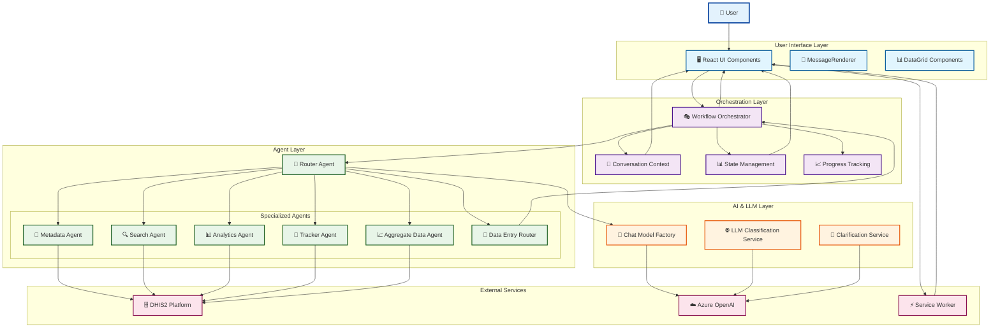

---

## 🔄 **Detailed Component Interaction Flow**

### User Query Processing Pipeline

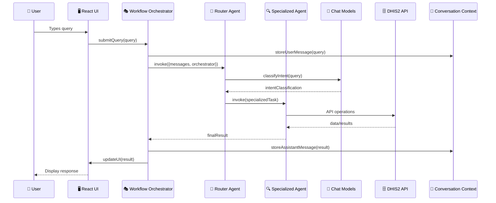

### Agent Routing Decision Tree

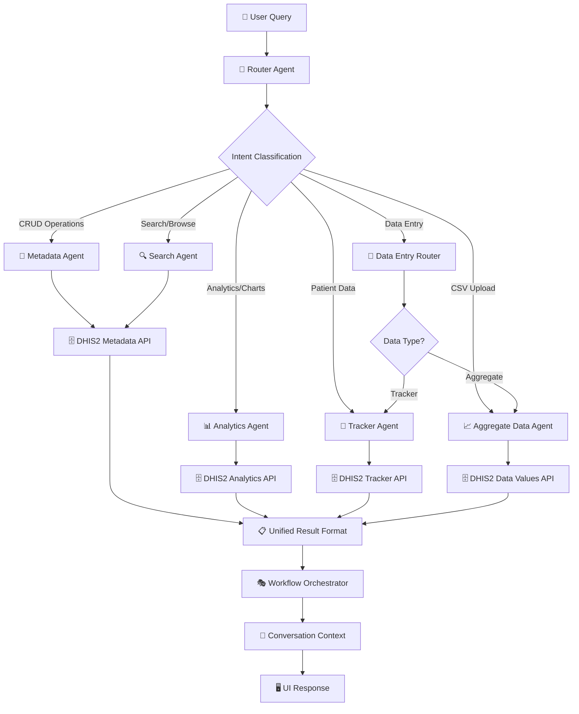

---

## 🧩 **Component Architecture Details**

### Workflow Orchestrator - Central Coordination Hub

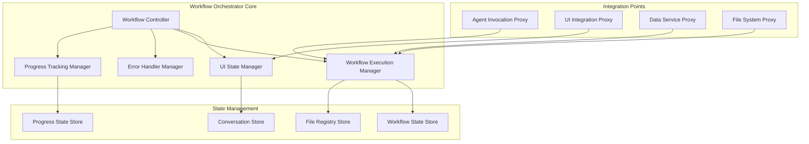

### Agent Architecture Patterns

#### Router Agent - Intelligent Traffic Director

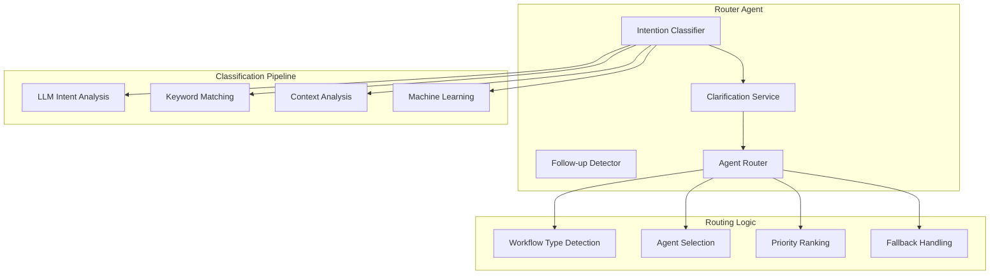

#### Specialized Agent Architecture

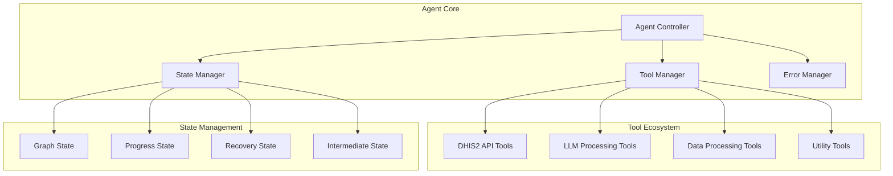

---

## 🌊 **Data Flow Architecture**

### Complete System Data Flow

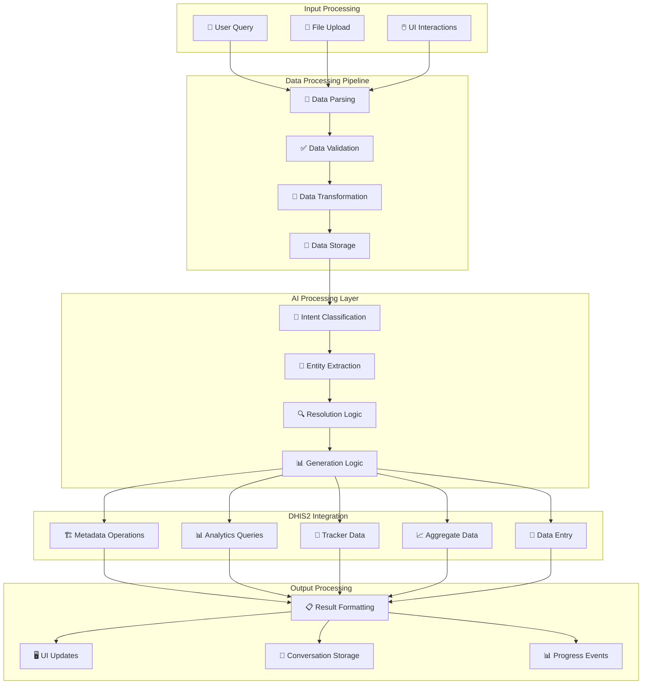

### State Management Data Flow

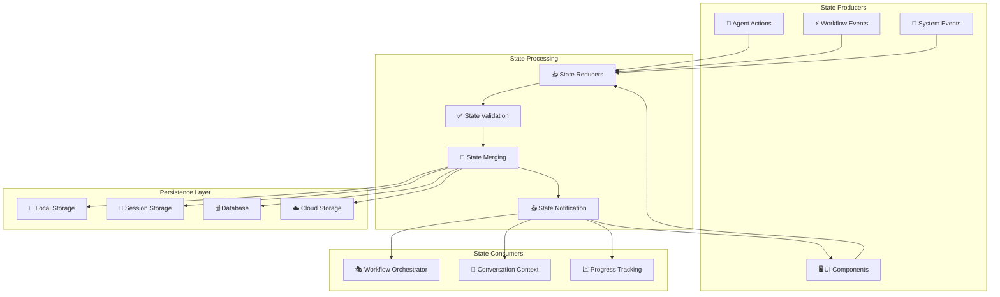

---

## 🔧 **Technology Stack Integration**

### Frontend Architecture

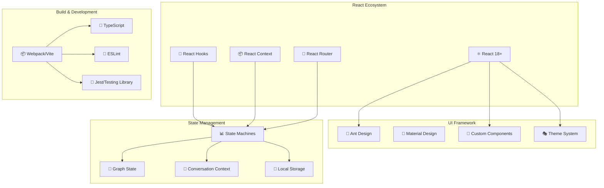

### Backend Integration Architecture

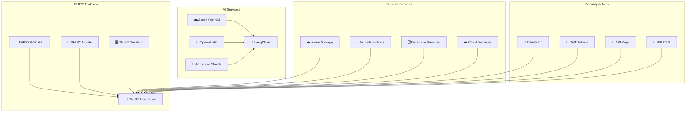

---

## 📊 **Performance & Scalability Architecture**

### Caching Strategy Architecture

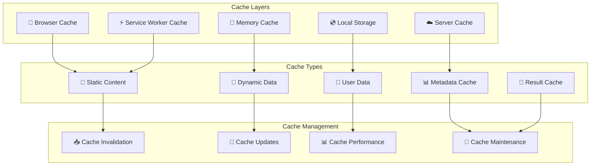

### Error Handling & Recovery Architecture

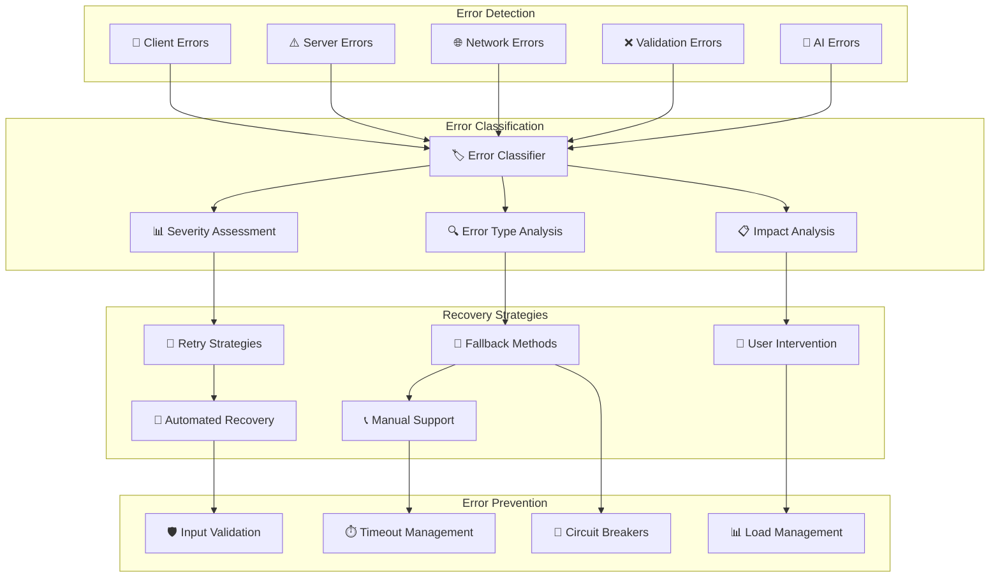

---

## 🔐 **Security Architecture**

### Authentication & Authorization

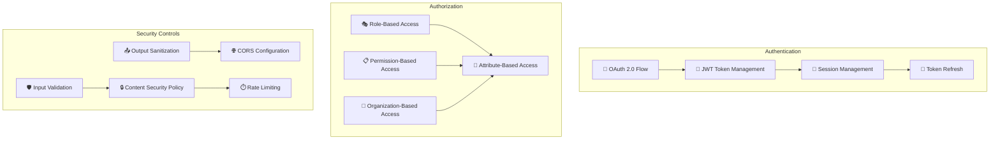

### Data Protection

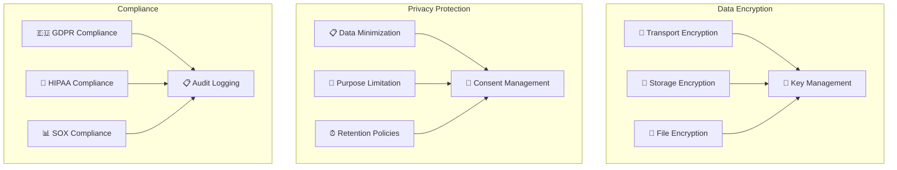

---

## 🚀 **Deployment Architecture**

### Development Environment

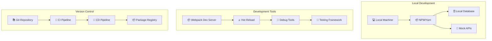

### Production Environment

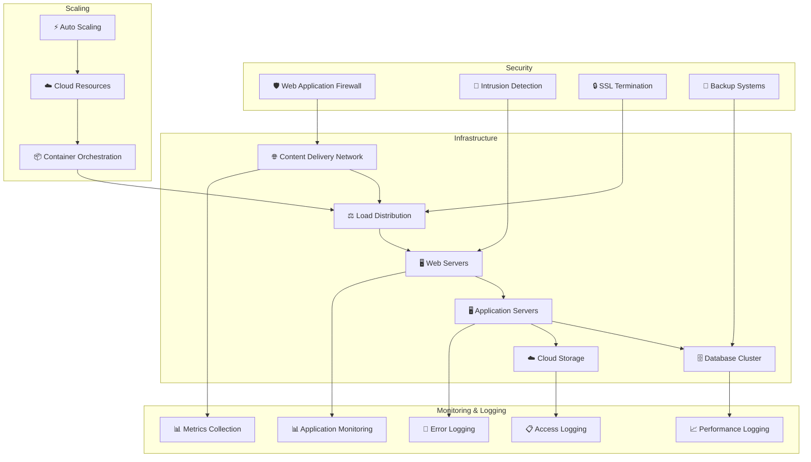

---

## 📈 **Monitoring & Observability**

### System Health Monitoring

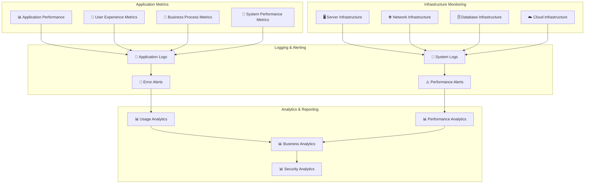

### Incident Response Architecture

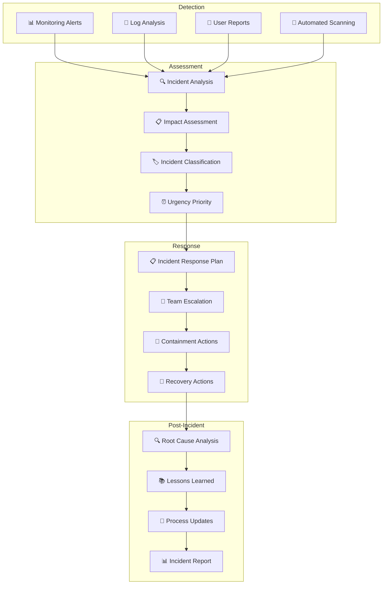

---

## 🎯 **Architecture Principles**

### Design Principles
1. **Modular Architecture**: Independent, swappable components
2. **Event-Driven Design**: Asynchronous communication patterns
3. **Progressive Enhancement**: Core functionality without JavaScript
4. **Mobile-First Design**: Responsive across all device types
5. **Accessibility First**: WCAG 2.1 AA compliance

### Performance Principles
1. **Lazy Loading**: Components and data loaded on demand
2. **Caching Strategy**: Multi-layer caching for optimal performance
3. **Progressive Rendering**: Content appears incrementally
4. **Resource Optimization**: Minimize bundle sizes and network requests
5. **Background Processing**: Non-blocking operations

### Security Principles
1. **Defense in Depth**: Multiple security layers
2. **Zero Trust Architecture**: Verify all access requests
3. **Data Minimization**: Collect only necessary data
4. **Privacy by Design**: Privacy considerations in all features
5. **Secure by Default**: Secure configurations enabled by default

### Scalability Principles
1. **Horizontal Scaling**: Add more instances as needed
2. **Stateless Design**: No server-side session state
3. **Microservices Ready**: Components can be independently scaled
4. **Cloud-Native**: Designed for cloud deployment
5. **Resource Efficiency**: Optimal resource utilization

---

This architecture provides a robust, scalable, and maintainable foundation for the DHIS2 AI Suite, enabling sophisticated conversational AI interactions with health data systems while maintaining high performance, security, and user experience standards.
