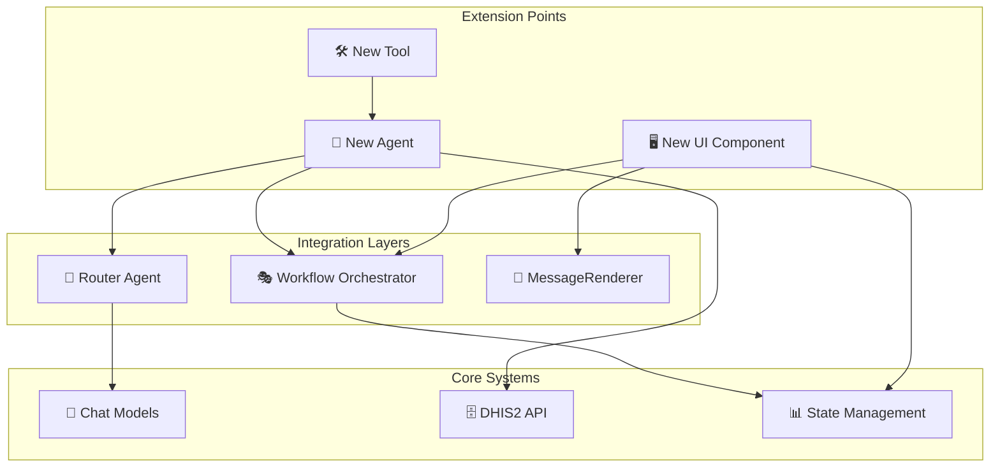
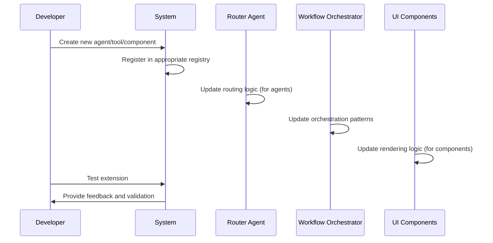

# 🚀 Extension Guide - Adding New Agents, Tools, and UI Components

## Overview

This guide provides comprehensive instructions for extending the DHIS2 AI Suite with new agents, tools, and UI components. The system is designed with modularity and extensibility in mind, allowing developers to add new capabilities following established patterns and best practices.

**Extension Points**:
- **Agents**: Specialized AI workflows for specific tasks
- **Tools**: Reusable functions for DHIS2 API interactions and data processing
- **UI Components**: Custom React components for new interaction patterns

**Prerequisites**: Familiarity with TypeScript, React, LangChain/LangGraph, and DHIS2 APIs

---

## 🏗️ **Extension Architecture Overview**

### Core Extension Patterns



### Extension Registration Flow



---

## 🤖 **Adding New Agents**

### Agent Architecture Template

#### 1. Agent Structure Overview
```typescript
// File: src/agents/your-new-agent.ts

import { Annotation, END, START, StateGraph } from '@langchain/langgraph/web';
import { ChatModels } from '../utils/chat-model-factory';
import { llmClassificationService } from '../utils/llm-classification-service';

// State definition using Annotation API
const AgentAnnotation = Annotation.Root({
    // Input state
    messages: Annotation<any[]>({
        reducer: (left, right) => right ? right : left,
        default: () => []
    }),
    query: Annotation<string>({
        reducer: (left, right) => right || left,
        default: () => ''
    }),

    // Processing state
    step: Annotation<string>({
        reducer: (left, right) => right || left,
        default: () => 'initial'
    }),

    // Orchestrator integration
    orchestrator: Annotation<any>({
        reducer: (left, right) => right || left,
        default: () => null
    }),

    // Agent-specific state
    // Add your custom state fields here

    // Output state
    finalResult: Annotation<any>({
        reducer: (left, right) => right || left,
        default: () => null
    }),
    error: Annotation<string>({
        reducer: (left, right) => right || left,
        default: () => ''
    })
});

// Node functions
async function processInitial(state: typeof AgentAnnotation.State): Promise<Partial<typeof AgentAnnotation.State>> {
    // Initial processing logic
    return {
        step: 'processing',
        // Updated state
    };
}

async function processMainLogic(state: typeof AgentAnnotation.State): Promise<Partial<typeof AgentAnnotation.State>> {
    // Main agent logic
    return {
        step: 'completed',
        finalResult: { /* result */ }
    };
}

// Workflow compilation
const workflow = new StateGraph(AgentAnnotation)
    .addNode('initial', processInitial)
    .addNode('main_logic', processMainLogic)
    .addEdge(START, 'initial')
    .addEdge('initial', 'main_logic')
    .addEdge('main_logic', END)
    .compile();

// Export the compiled agent
export { workflow as yourNewAgent };
```

#### 2. Agent Registration

Add your agent to the router agent routing logic:

```typescript
// File: src/agents/router-agent.ts

// Add to the agent routing logic
function routeToAgent(intentClassification: any): string {
    switch (intentClassification.primaryIntent) {
        case 'your_new_capability':
            return 'your_new_agent';
        // ... other cases
    }
}

// Add to agent function mapping
private getAgentFunction(agentName: string): any {
    switch (agentName) {
        case 'your_new_agent':
            return async (input: any) => {
                const { yourNewAgent } = await import('./your-new-agent');
                return yourNewAgent.invoke(input);
            };
        // ... other agents
    }
}
```

#### 3. Intent Classification Updates

Update the LLM classification prompts to recognize your new agent:

```typescript
// File: src/agents/router-agent.ts

const routingPrompt = `
Analyze this query and route to the appropriate agent:

AGENTS AVAILABLE:
- analytics: For data analysis, charts, and reporting
- search: For finding metadata and information
- metadata: For CRUD operations on DHIS2 metadata
- tracker: For patient data processing and tracker entities
- aggregate_data: For CSV upload and bulk data entry
- your_new_agent: [Describe what your agent does]

QUERY: "${query}"

Return JSON: {"agent": "agent_name", "confidence": 0.95, "reasoning": "explanation"}
`;
```

### Complete Agent Example: Custom Reporting Agent

#### Step 1: Define Agent State
```typescript
// File: src/agents/custom-reporting-agent.ts

const ReportingAnnotation = Annotation.Root({
    // Input
    messages: Annotation<any[]>({
        reducer: (left, right) => right || left,
        default: () => []
    }),
    query: Annotation<string>({
        reducer: (left, right) => right || left,
        default: () => ''
    }),

    // Processing state
    reportType: Annotation<string>({
        reducer: (left, right) => right || left,
        default: () => ''
    }),
    parameters: Annotation<any>({
        reducer: (left, right) => right || left,
        default: () => ({})
    }),
    generatedReport: Annotation<any>({
        reducer: (left, right) => right || left,
        default: () => null
    }),

    // Orchestrator integration
    orchestrator: Annotation<any>({
        reducer: (left, right) => right || left,
        default: () => null
    }),

    // Output
    finalResult: Annotation<any>({
        reducer: (left, right) => right || left,
        default: () => null
    }),
    error: Annotation<string>({
        reducer: (left, right) => right || left,
        default: () => ''
    })
});
```

#### Step 2: Implement Node Functions
```typescript
async function classifyReportType(state: typeof ReportingAnnotation.State): Promise<Partial<typeof ReportingAnnotation.State>> {
    const query = state.query;

    // Use LLM to classify report type
    const classificationPrompt = `
    Classify this reporting request:

    QUERY: "${query}"

    REPORT TYPES:
    - summary: Basic statistics and summaries
    - detailed: Comprehensive reports with breakdowns
    - comparative: Comparisons between periods/locations
    - trend: Time-series analysis and trends

    Return JSON: {"type": "report_type", "parameters": {...}}
    `;

    try {
        const model = ChatModels.createAgentModel();
        const result = await model.invoke([new HumanMessage(classificationPrompt)]);
        const classification = JSON.parse(result.content as string);

        return {
            reportType: classification.type,
            parameters: classification.parameters
        };
    } catch (error) {
        return {
            error: `Failed to classify report type: ${error.message}`,
            finalResult: {
                success: false,
                error: error.message
            }
        };
    }
}

async function generateReport(state: typeof ReportingAnnotation.State): Promise<Partial<typeof ReportingAnnotation.State>> {
    const { reportType, parameters, orchestrator } = state;

    // Update progress
    orchestrator?.addProgressMessage('Generating custom report...');

    try {
        // Generate report based on type
        let reportData;

        switch (reportType) {
            case 'summary':
                reportData = await generateSummaryReport(parameters);
                break;
            case 'detailed':
                reportData = await generateDetailedReport(parameters);
                break;
            case 'comparative':
                reportData = await generateComparativeReport(parameters);
                break;
            case 'trend':
                reportData = await generateTrendReport(parameters);
                break;
            default:
                throw new Error(`Unknown report type: ${reportType}`);
        }

        return {
            generatedReport: reportData,
            finalResult: {
                success: true,
                reportType,
                data: reportData,
                message: `Generated ${reportType} report successfully`
            }
        };
    } catch (error) {
        return {
            error: error.message,
            finalResult: {
                success: false,
                error: error.message
            }
        };
    }
}
```

#### Step 3: Compile Workflow
```typescript
const reportingWorkflow = new StateGraph(ReportingAnnotation)
    .addNode('classify_report', classifyReportType)
    .addNode('generate_report', generateReport)
    .addEdge(START, 'classify_report')
    .addEdge('classify_report', 'generate_report')
    .addEdge('generate_report', END)
    .compile();

export { reportingWorkflow as customReportingAgent };
```

#### Step 4: Update Router Integration
```typescript
// File: src/agents/router-agent.ts

// Add to routing logic
case 'custom_reporting':
    return 'custom_reporting_agent';

// Add to agent functions
case 'custom_reporting_agent':
    return async (input: any) => {
        const { customReportingAgent } = await import('./custom-reporting-agent');
        return customReportingAgent.invoke(input);
    };

// Update classification prompt
const routingPrompt = `
AGENTS AVAILABLE:
- analytics: For data analysis, charts, and reporting
- custom_reporting: For specialized custom reports and advanced analytics
- search: For finding metadata and information
// ... other agents
`;
```

---

## 🛠️ **Creating New Tools**

### Tool Architecture Patterns

#### 1. Basic Tool Structure
```typescript
// File: src/utils/tools/your-custom-tool.ts

import { tool } from '@langchain/core/tools';
import { z } from 'zod';

// Define tool input schema
const toolSchema = z.object({
    parameter1: z.string().describe("Description of parameter 1"),
    parameter2: z.number().optional().describe("Optional numeric parameter"),
});

// Create the tool
export const yourCustomTool = tool(
    async ({ parameter1, parameter2 }) => {
        try {
            // Tool implementation
            const result = await performOperation(parameter1, parameter2);

            return {
                success: true,
                data: result,
                message: "Operation completed successfully"
            };
        } catch (error) {
            return {
                success: false,
                error: error.message,
                message: "Operation failed"
            };
        }
    },
    {
        name: "your_custom_tool",
        description: "Description of what this tool does",
        schema: toolSchema,
    }
);
```

#### 2. Tool Registration

Add your tool to the appropriate agent:

```typescript
// File: src/agents/your-agent.ts

import { yourCustomTool } from '../utils/tools/your-custom-tool';

// Add to agent tools
const agentTools = [
    yourCustomTool,
    // ... other tools
];

// Create agent with tools
const agent = createReactAgent({
    llm: model,
    tools: agentTools,
    // ... other config
});
```

### Advanced Tool Patterns

#### DHIS2 API Tool Template
```typescript
// File: src/utils/tools/dhis2-custom-tool.ts

import { tool } from '@langchain/core/tools';
import { z } from 'zod';
import { Dhis2Api } from '../app-runtime/dhis2-api';

const dhis2ToolSchema = z.object({
    resource: z.string().describe("DHIS2 API resource endpoint"),
    filters: z.record(z.any()).optional().describe("API filters"),
    fields: z.string().optional().describe("Fields to return"),
});

export const dhis2CustomTool = tool(
    async ({ resource, filters, fields }) => {
        try {
            const queryParams = {
                ...filters,
                fields: fields || 'id,name'
            };

            const response = await Dhis2Api.query({
                [resource]: {
                    resource: `${resource}.json`,
                    params: queryParams
                }
            });

            return {
                success: true,
                data: response.data[resource],
                count: response.data[resource]?.length || 0,
                message: `Retrieved ${response.data[resource]?.length || 0} ${resource}`
            };
        } catch (error) {
            return {
                success: false,
                error: error.message,
                message: `Failed to query ${resource}`
            };
        }
    },
    {
        name: "dhis2_custom_query",
        description: "Query any DHIS2 API endpoint with custom filters",
        schema: dhis2ToolSchema,
    }
);
```

#### LLM-Powered Tool Template
```typescript
// File: src/utils/tools/llm-powered-tool.ts

import { tool } from '@langchain/core/tools';
import { z } from 'zod';
import { ChatModels } from '../chat-model-factory';

const llmToolSchema = z.object({
    input: z.string().describe("Input text to process"),
    instruction: z.string().describe("Specific instruction for processing"),
    context: z.string().optional().describe("Additional context"),
});

export const llmPoweredTool = tool(
    async ({ input, instruction, context }) => {
        try {
            const model = ChatModels.createAgentModel();

            const prompt = `
            ${instruction}

            INPUT: ${input}
            ${context ? `CONTEXT: ${context}` : ''}

            Provide a detailed, structured response.
            `;

            const result = await model.invoke([new HumanMessage(prompt)]);
            const processedOutput = result.content as string;

            return {
                success: true,
                processed: processedOutput,
                inputLength: input.length,
                message: "LLM processing completed"
            };
        } catch (error) {
            return {
                success: false,
                error: error.message,
                message: "LLM processing failed"
            };
        }
    },
    {
        name: "llm_powered_processor",
        description: "Process text using LLM with custom instructions",
        schema: llmToolSchema,
    }
);
```

### Tool Integration in Agents

#### Adding Tools to Existing Agents
```typescript
// File: src/agents/metadata-agent.ts

import { yourCustomTool } from '../utils/tools/your-custom-tool';

// Add to existing tool list
const metadataTools = [
    // ... existing tools
    yourCustomTool,
];

// Update agent creation
const metadataAgent = createReactAgent({
    llm: model,
    tools: metadataTools,
    // ... other config
});
```

#### Tool Discovery and Documentation
```typescript
// File: src/utils/tools/index.ts

// Export all tools for easy discovery
export { yourCustomTool } from './your-custom-tool';
export { dhis2CustomTool } from './dhis2-custom-tool';
export { llmPoweredTool } from './llm-powered-tool';

// Tool registry for documentation
export const toolRegistry = {
    yourCustomTool: {
        name: 'your_custom_tool',
        description: 'Description of what this tool does',
        parameters: {
            parameter1: 'string - Description of parameter 1',
            parameter2: 'number (optional) - Description of parameter 2'
        },
        returns: 'Tool execution result with success/error status'
    },
    // ... other tools
};
```

---

## 🖥️ **Developing UI Components**

### Component Architecture Patterns

#### 1. Basic Component Structure
```typescript
// File: src/components/YourCustomComponent.tsx

import React, { useState, useEffect } from 'react';

interface YourCustomComponentProps {
    // Define props interface
    data?: any;
    onAction?: (action: string, data?: any) => void;
    orchestrator?: any;
    className?: string;
}

const YourCustomComponent: React.FC<YourCustomComponentProps> = ({
    data,
    onAction,
    orchestrator,
    className
}) => {
    const [state, setState] = useState<any>({});
    const [loading, setLoading] = useState(false);

    // Component logic here

    return (
        <div className={`your-custom-component ${className || ''}`}>
            {/* Component JSX */}
        </div>
    );
};

export default YourCustomComponent;
```

#### 2. MessageRenderer Integration

Add your component to the MessageRenderer:

```typescript
// File: src/components/MessageRenderer.tsx

import YourCustomComponent from './YourCustomComponent';

// Add to message type handling
const renderMessageContent = (message: ConversationMessage) => {
    switch (message.type) {
        case 'your_custom_type':
            return (
                <YourCustomComponent
                    data={message.data}
                    onAction={(action, data) => handleComponentAction(action, data)}
                    orchestrator={orchestrator}
                />
            );
        // ... other message types
    }
};
```

### Advanced Component Patterns

#### Interactive Data Component
```typescript
// File: src/components/InteractiveDataComponent.tsx

import React, { useState, useCallback } from 'react';
import { Button, Input, Select, message } from 'antd';

interface InteractiveDataComponentProps {
    data: any;
    onUpdate?: (updates: any) => void;
    onSubmit?: (data: any) => void;
    orchestrator?: any;
}

const InteractiveDataComponent: React.FC<InteractiveDataComponentProps> = ({
    data,
    onUpdate,
    onSubmit,
    orchestrator
}) => {
    const [editedData, setEditedData] = useState(data || {});
    const [validationErrors, setValidationErrors] = useState<Record<string, string>>({});

    const handleFieldChange = useCallback((field: string, value: any) => {
        const updated = { ...editedData, [field]: value };
        setEditedData(updated);

        // Clear validation error for this field
        if (validationErrors[field]) {
            setValidationErrors(prev => {
                const next = { ...prev };
                delete next[field];
                return next;
            });
        }

        onUpdate?.(updated);
    }, [editedData, validationErrors, onUpdate]);

    const validateData = useCallback(() => {
        const errors: Record<string, string> = {};

        // Add your validation logic here
        if (!editedData.name?.trim()) {
            errors.name = 'Name is required';
        }

        if (editedData.value !== undefined && editedData.value < 0) {
            errors.value = 'Value must be non-negative';
        }

        setValidationErrors(errors);
        return Object.keys(errors).length === 0;
    }, [editedData]);

    const handleSubmit = useCallback(async () => {
        if (!validateData()) {
            message.error('Please fix validation errors');
            return;
        }

        try {
            await onSubmit?.(editedData);
            message.success('Data submitted successfully');

            // Add to conversation
            orchestrator?.addAssistantMessage(
                'Data processed successfully',
                'response',
                { submittedData: editedData }
            );
        } catch (error) {
            message.error(`Submission failed: ${error.message}`);
        }
    }, [editedData, validateData, onSubmit, orchestrator]);

    return (
        <div className="interactive-data-component">
            <div className="data-fields">
                {/* Render form fields based on data structure */}
                {Object.entries(editedData).map(([key, value]) => (
                    <div key={key} className="field-group">
                        <label>{key.charAt(0).toUpperCase() + key.slice(1)}:</label>
                        <Input
                            value={value as string}
                            onChange={(e) => handleFieldChange(key, e.target.value)}
                            status={validationErrors[key] ? 'error' : undefined}
                        />
                        {validationErrors[key] && (
                            <div className="error-message">{validationErrors[key]}</div>
                        )}
                    </div>
                ))}
            </div>

            <div className="actions">
                <Button onClick={handleSubmit} type="primary">
                    Submit Data
                </Button>
            </div>
        </div>
    );
};

export default InteractiveDataComponent;
```

#### Workflow-Integrated Component
```typescript
// File: src/components/WorkflowComponent.tsx

import React, { useEffect, useState } from 'react';
import { Progress, Alert, Button } from 'antd';
import { workflowOrchestrator } from '../utils/workflow-orchestrator';

interface WorkflowComponentProps {
    workflowId: string;
    workflowType: string;
    initialData?: any;
    onComplete?: (result: any) => void;
    onError?: (error: any) => void;
}

const WorkflowComponent: React.FC<WorkflowComponentProps> = ({
    workflowId,
    workflowType,
    initialData,
    onComplete,
    onError
}) => {
    const [progress, setProgress] = useState<any>(null);
    const [currentStep, setCurrentStep] = useState<string>('');
    const [error, setError] = useState<string | null>(null);
    const [result, setResult] = useState<any>(null);

    useEffect(() => {
        // Start workflow
        const startWorkflow = async () => {
            try {
                const workflowResult = await workflowOrchestrator.startWorkflow(
                    workflowType,
                    {
                        workflowId,
                        input: { messages: [], data: initialData },
                        flow: workflowType
                    },
                    async (input) => {
                        // Get the appropriate agent
                        const agentFn = workflowOrchestrator.getAgentFunction(workflowType);
                        if (!agentFn) {
                            throw new Error(`Unknown workflow type: ${workflowType}`);
                        }
                        return await agentFn(input);
                    }
                );

                setResult(workflowResult);
                onComplete?.(workflowResult);
            } catch (err) {
                const errorMessage = err.message || 'Workflow failed';
                setError(errorMessage);
                onError?.(err);
            }
        };

        startWorkflow();
    }, [workflowId, workflowType, initialData, onComplete, onError]);

    useEffect(() => {
        // Monitor progress
        const progressInterval = setInterval(() => {
            const workflowProgress = workflowOrchestrator.getWorkflowProgress(workflowId);
            if (workflowProgress) {
                setProgress(workflowProgress);
                setCurrentStep(workflowProgress.currentStep || '');
            }
        }, 1000);

        return () => clearInterval(progressInterval);
    }, [workflowId]);

    if (error) {
        return (
            <Alert
                message="Workflow Error"
                description={error}
                type="error"
                showIcon
                action={
                    <Button
                        size="small"
                        onClick={() => window.location.reload()}
                    >
                        Retry
                    </Button>
                }
            />
        );
    }

    if (result) {
        return (
            <Alert
                message="Workflow Complete"
                description="The workflow has completed successfully"
                type="success"
                showIcon
            />
        );
    }

    return (
        <div className="workflow-component">
            <div className="workflow-header">
                <h3>{workflowType.replace('_', ' ').toUpperCase()} Workflow</h3>
                <p>Processing your request...</p>
            </div>

            {progress && (
                <div className="workflow-progress">
                    <Progress
                        percent={progress.overallProgress}
                        status={progress.overallProgress === 100 ? 'success' : 'active'}
                        format={(percent) => `${percent}%`}
                    />
                    <div className="current-step">
                        Current: {currentStep || 'Initializing...'}
                    </div>
                    {progress.estimatedTimeRemaining && (
                        <div className="time-remaining">
                            Est. time remaining: {Math.round(progress.estimatedTimeRemaining / 1000)}s
                        </div>
                    )}
                </div>
            )}
        </div>
    );
};

export default WorkflowComponent;
```

### Component Registration and Styling

#### Component Registration
```typescript
// File: src/components/index.ts

// Export all components for easy importing
export { default as YourCustomComponent } from './YourCustomComponent';
export { default as InteractiveDataComponent } from './InteractiveDataComponent';
export { default as WorkflowComponent } from './WorkflowComponent';

// Component registry for dynamic loading
export const componentRegistry = {
    YourCustomComponent: {
        component: () => import('./YourCustomComponent'),
        description: 'Custom component for specialized interactions'
    },
    InteractiveDataComponent: {
        component: () => import('./InteractiveDataComponent'),
        description: 'Interactive form component with validation'
    },
    WorkflowComponent: {
        component: () => import('./WorkflowComponent'),
        description: 'Workflow execution and progress monitoring'
    }
};
```

#### Component Styling
```css
/* File: src/styles/components/your-custom-component.css */

.your-custom-component {
    background: var(--color-bg-primary);
    border: 1px solid var(--color-border-light);
    border-radius: var(--radius-md);
    padding: var(--space-lg);
    margin: var(--space-md) 0;
}

.your-custom-component .data-fields {
    display: flex;
    flex-direction: column;
    gap: var(--space-md);
}

.your-custom-component .field-group {
    display: flex;
    flex-direction: column;
    gap: var(--space-sm);
}

.your-custom-component .field-group label {
    font-weight: var(--font-weight-semibold);
    color: var(--color-text-primary);
}

.your-custom-component .error-message {
    color: var(--color-error);
    font-size: var(--font-size-sm);
}

.your-custom-component .actions {
    margin-top: var(--space-lg);
    display: flex;
    justify-content: flex-end;
    gap: var(--space-md);
}
```

---

## 🧪 **Testing Extensions**

### Unit Testing Patterns

#### Agent Testing
```typescript
// File: src/agents/__tests__/your-new-agent.test.ts

import { yourNewAgent } from '../your-new-agent';

describe('Your New Agent', () => {
    it('should process input correctly', async () => {
        const input = {
            messages: [{ role: 'user', content: 'test query' }],
            query: 'test query',
            orchestrator: mockOrchestrator
        };

        const result = await yourNewAgent.invoke(input);

        expect(result.finalResult).toBeDefined();
        expect(result.finalResult.success).toBe(true);
    });

    it('should handle errors gracefully', async () => {
        const input = {
            messages: [{ role: 'user', content: 'invalid query' }],
            query: 'invalid query'
        };

        const result = await yourNewAgent.invoke(input);

        expect(result.error).toBeDefined();
        expect(result.finalResult.success).toBe(false);
    });
});
```

#### Tool Testing
```typescript
// File: src/utils/tools/__tests__/your-custom-tool.test.ts

import { yourCustomTool } from '../your-custom-tool';

describe('Your Custom Tool', () => {
    it('should execute successfully with valid input', async () => {
        const result = await yourCustomTool.invoke({
            parameter1: 'test value',
            parameter2: 42
        });

        expect(result.success).toBe(true);
        expect(result.data).toBeDefined();
    });

    it('should validate input parameters', async () => {
        await expect(
            yourCustomTool.invoke({
                parameter1: '', // Invalid empty string
                parameter2: -1  // Invalid negative number
            })
        ).rejects.toThrow();
    });
});
```

#### Component Testing
```typescript
// File: src/components/__tests__/YourCustomComponent.test.tsx

import React from 'react';
import { render, screen, fireEvent } from '@testing-library/react';
import YourCustomComponent from '../YourCustomComponent';

describe('YourCustomComponent', () => {
    it('should render correctly', () => {
        render(<YourCustomComponent data={{ test: 'value' }} />);

        expect(screen.getByText('value')).toBeInTheDocument();
    });

    it('should handle user interactions', () => {
        const mockOnAction = jest.fn();
        render(
            <YourCustomComponent
                data={{ test: 'value' }}
                onAction={mockOnAction}
            />
        );

        const button = screen.getByRole('button');
        fireEvent.click(button);

        expect(mockOnAction).toHaveBeenCalledWith('action', expect.any(Object));
    });
});
```

### Integration Testing

#### End-to-End Extension Testing
```typescript
// File: e2e/extensions/your-extension.e2e.test.ts

describe('Your Extension E2E', () => {
    it('should work end-to-end', async () => {
        // Start the application
        await page.goto('/');

        // Interact with your extension
        await page.type('input', 'test query for your extension');
        await page.click('button[type="submit"]');

        // Wait for response
        await page.waitForSelector('.your-extension-result');

        // Verify results
        const result = await page.$('.your-extension-result');
        expect(result).toBeTruthy();
    });
});
```

---

## 📋 **Extension Checklist**

### Pre-Development Checklist
- [ ] **Understand Requirements**: Clearly define what your extension does
- [ ] **Review Existing Patterns**: Study similar existing agents/tools/components
- [ ] **Plan Integration Points**: Identify how it connects to the orchestrator
- [ ] **Design State Management**: Plan your StateAnnotation structure
- [ ] **Consider Error Handling**: Plan for failure scenarios and recovery

### Development Checklist
- [ ] **Create Agent/Tool/Component**: Implement using established patterns
- [ ] **Add State Management**: Define StateAnnotation with proper reducers
- [ ] **Implement Error Handling**: Add try/catch blocks and recovery logic
- [ ] **Add Progress Tracking**: Integrate with workflow progress system
- [ ] **Update Router Logic**: Add routing for new agents
- [ ] **Register Components**: Add to MessageRenderer for UI components

### Testing Checklist
- [ ] **Unit Tests**: Test individual functions and components
- [ ] **Integration Tests**: Test with orchestrator and other components
- [ ] **Error Scenarios**: Test failure modes and recovery
- [ ] **Performance Tests**: Ensure acceptable response times
- [ ] **Browser Compatibility**: Test in target browsers

### Documentation Checklist
- [ ] **Code Comments**: Document complex logic and edge cases
- [ ] **README Updates**: Update main documentation
- [ ] **API Documentation**: Document public interfaces
- [ ] **Usage Examples**: Provide practical examples
- [ ] **Troubleshooting Guide**: Document common issues

### Deployment Checklist
- [ ] **Build Verification**: Ensure extension builds correctly
- [ ] **Bundle Analysis**: Check impact on bundle size
- [ ] **Performance Impact**: Verify no performance regressions
- [ ] **Backwards Compatibility**: Ensure existing functionality still works
- [ ] **Feature Flags**: Consider adding feature flags for gradual rollout

---

## 🚨 **Best Practices**

### Performance Considerations
1. **Lazy Loading**: Load extensions only when needed
2. **Bundle Splitting**: Keep extension bundles separate
3. **Memory Management**: Clean up event listeners and timers
4. **Caching Strategy**: Cache expensive operations appropriately

### Security Considerations
1. **Input Validation**: Always validate inputs from users
2. **API Security**: Use proper authentication for external APIs
3. **Data Sanitization**: Sanitize data before rendering
4. **Permission Checks**: Verify user permissions for operations

### Maintainability Considerations
1. **Consistent Patterns**: Follow established architectural patterns
2. **Clear Interfaces**: Define clear contracts between components
3. **Documentation**: Keep documentation up-to-date
4. **Testing**: Maintain comprehensive test coverage

### Scalability Considerations
1. **Modular Design**: Keep extensions loosely coupled
2. **Configurable**: Make extensions configurable for different environments
3. **Monitoring**: Add appropriate monitoring and logging
4. **Resource Limits**: Implement appropriate limits and quotas

---

## 📞 **Support and Resources**

### Getting Help
- **Documentation**: Refer to existing agent/tool/component implementations
- **Code Examples**: Study the analytics agent, metadata tools, and data grids
- **Community**: Check existing issues and discussions
- **Architecture Docs**: Review the architecture deep dive documentation

### Common Pitfalls to Avoid
- **Tight Coupling**: Avoid hard dependencies between extensions
- **Global State Pollution**: Keep state localized to your extension
- **Blocking Operations**: Use async/await for all I/O operations
- **Memory Leaks**: Always clean up event listeners and subscriptions
- **Race Conditions**: Handle concurrent operations carefully

This extension guide provides the foundation for adding new capabilities to the DHIS2 AI Suite while maintaining consistency, performance, and maintainability. Follow these patterns to ensure your extensions integrate seamlessly with the existing system.
