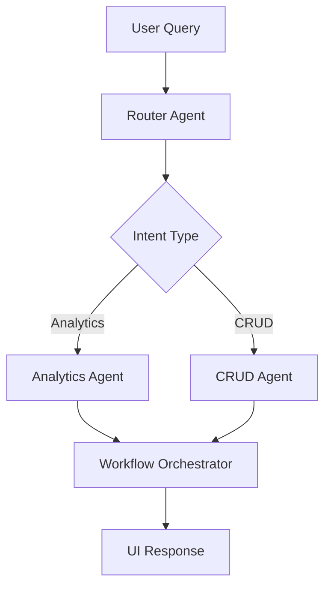

# 🚀 Development Workflows - DHIS2 AI Suite

## Overview

This document outlines the development workflows, coding standards, and best practices for contributing to the DHIS2 AI Suite. Following these guidelines ensures consistent, maintainable, and high-quality code across the project.

**Target Audience**: Developers contributing to the DHIS2 AI Suite

**Key Topics**:
- Coding standards and patterns
- Development environment setup
- Testing procedures and guidelines
- Branching strategy and contribution workflow
- Code review processes

---

## 🏗️ **Architecture Patterns**

### Agent-Based Architecture

The system follows a **modular agent architecture** where each agent is responsible for a specific domain:

```
Router Agent → Specialized Agents → Workflow Orchestrator → UI
```

#### Agent Implementation Pattern
```typescript
// Standard agent interface
export const agentName = {
    invoke: async (input: AgentInput): Promise<AgentOutput> => {
        // Agent logic here
        return { messages: [{ content: JSON.stringify(result) }] };
    }
};
```

#### StateGraph Pattern
For complex workflows, use LangGraph StateGraph:
```typescript
const StateAnnotation = Annotation.Root({
    // Define state structure
    messages: Annotation<any[]>(),
    workflowProgress: Annotation<ProgressState>(),
    // ... other state fields
});

// Define workflow nodes
async function node_function(state: typeof StateAnnotation.State) {
    // Node logic
    return { updatedField: newValue };
}

// Compile workflow
const workflow = new StateGraph(StateAnnotation)
    .addNode('node_name', node_function)
    .addEdge(START, 'node_name')
    .addEdge('node_name', END)
    .compile();
```

### Component Architecture

#### React Component Pattern
```typescript
interface ComponentProps {
    // Define props interface
}

export const ComponentName: React.FC<ComponentProps> = ({ prop1, prop2 }) => {
    return (
        <div className="component-class">
            {/* Component JSX */}
        </div>
    );
};
```

#### Custom Hook Pattern
```typescript
export const useCustomHook = (param: Type) => {
    const [state, setState] = useState<InitialType>(initialValue);

    const action = useCallback(() => {
        // Hook logic
    }, [dependencies]);

    return { state, action };
};
```

---

## 📝 **Coding Standards**

### TypeScript Guidelines

#### Type Definitions
- **Always use explicit types** for function parameters and return values
- **Prefer interfaces over types** for object shapes
- **Use union types** for variant values
- **Avoid `any` type** - use specific types or `unknown`

```typescript
// ✅ Good
interface User {
    id: string;
    name: string;
    role: 'admin' | 'user';
}

const getUser = (id: string): Promise<User> => {
    // Implementation
};

// ❌ Avoid
const getUser = (id: any): any => {
    // Implementation
};
```

#### Import Organization
```typescript
// Group imports by type, separate with blank lines
import React from 'react';
import { useState, useEffect } from 'react';

import { ChatModels } from '../utils/chat-model-factory';
import { llmClassificationService } from '../utils/llm-classification-service';

import type { AgentInput } from './types';
```

### Naming Conventions

#### Files and Directories
- **kebab-case** for file names: `workflow-orchestrator.ts`
- **camelCase** for directory names: `utils/tools`
- **PascalCase** for React components: `MessageRenderer.tsx`

#### Variables and Functions
- **camelCase** for variables and functions: `userMessage`, `processQuery()`
- **PascalCase** for types and interfaces: `UserProfile`, `AgentConfig`
- **UPPER_SNAKE_CASE** for constants: `MAX_RETRIES`, `DEFAULT_TIMEOUT`

#### Agents and Classes
- **Descriptive names**: `RouterAgent`, `AnalyticsGraphAgent`
- **Suffix patterns**: `Agent` for agents, `Service` for services

### Code Organization

#### File Structure
```
src/
├── agents/                 # AI agent implementations
├── components/             # React UI components
├── utils/                  # Utility functions and services
│   ├── tools/             # DHIS2 API tools
│   └── app-runtime/       # DHIS2 platform integration
├── types/                 # TypeScript type definitions
└── styles/                # CSS and styling
```

#### Function Organization
- **Single responsibility** principle
- **Maximum 50 lines** per function
- **Early returns** for error conditions
- **Descriptive function names**

```typescript
// ✅ Good
const validateUserInput = (input: string): ValidationResult => {
    if (!input?.trim()) {
        return { isValid: false, error: 'Input is required' };
    }

    if (input.length > 1000) {
        return { isValid: false, error: 'Input too long' };
    }

    return { isValid: true };
};

// ❌ Avoid
const check = (i: string) => {
    // Complex validation logic mixed with other concerns
    // Hard to test and maintain
};
```

### Error Handling

#### Try-Catch Patterns
```typescript
try {
    const result = await riskyOperation();
    return { success: true, data: result };
} catch (error) {
    console.error('Operation failed:', error);
    return {
        success: false,
        error: error.message,
        errorType: getErrorType(error)
    };
}
```

#### Error Types
```typescript
type ErrorType = 'NETWORK' | 'VALIDATION' | 'TIMEOUT' | 'UNKNOWN';

const getErrorType = (error: any): ErrorType => {
    if (error.code === 'NETWORK_ERROR') return 'NETWORK';
    if (error.message?.includes('timeout')) return 'TIMEOUT';
    if (error.message?.includes('validation')) return 'VALIDATION';
    return 'UNKNOWN';
};
```

---

## 🧪 **Testing Guidelines**

### Testing Strategy

#### Test Types
- **Unit Tests**: Individual functions and components
- **Integration Tests**: Agent workflows and API interactions
- **E2E Tests**: Complete user workflows

#### Test File Organization
```
src/
├── components/
│   ├── Button.tsx
│   └── Button.test.tsx
└── utils/
    ├── api-client.ts
    └── api-client.test.ts
```

### Unit Testing Patterns

#### Component Testing
```typescript
import { render, screen, fireEvent } from '@testing-library/react';
import { Button } from './Button';

describe('Button', () => {
    it('renders with correct text', () => {
        render(<Button>Click me</Button>);
        expect(screen.getByText('Click me')).toBeInTheDocument();
    });

    it('calls onClick when clicked', () => {
        const handleClick = jest.fn();
        render(<Button onClick={handleClick}>Click me</Button>);

        fireEvent.click(screen.getByText('Click me'));
        expect(handleClick).toHaveBeenCalledTimes(1);
    });
});
```

#### Agent Testing
```typescript
describe('RouterAgent', () => {
    it('routes analytics queries to analytics agent', async () => {
        const input = {
            messages: [{ role: 'user', content: 'Show me malaria trends' }]
        };

        const result = await routerAgent.invoke(input);
        const parsed = JSON.parse(result.messages[0].content);

        expect(parsed.workflowType).toBe('analytics_routing');
    });
});
```

### Mocking Strategy

#### API Mocking
```typescript
import { rest } from 'msw';
import { setupServer } from 'msw/node';

const server = setupServer(
    rest.get('/api/dataElements', (req, res, ctx) => {
        return res(ctx.json({ dataElements: mockDataElements }));
    })
);

beforeAll(() => server.listen());
afterEach(() => server.resetHandlers());
afterAll(() => server.close());
```

#### LLM Service Mocking
```typescript
jest.mock('../utils/llm-classification-service', () => ({
    llmClassificationService: {
        classifyIntent: jest.fn().mockResolvedValue({
            intent: 'search',
            confidence: 0.9
        })
    }
}));
```

### Test Coverage Goals

- **Minimum 80%** line coverage
- **Critical path coverage** for all user workflows
- **Error condition testing** for robustness
- **Integration test coverage** for agent interactions

---

## 🌿 **Branching Strategy**

### Git Workflow

#### Branch Naming Convention
```
feature/ISSUE-123-short-description
bugfix/ISSUE-456-fix-description
hotfix/critical-security-fix
release/v1.2.0
```

#### Main Branches
- **`main`**: Production-ready code
- **`develop`**: Integration branch for features
- **`feature/*`**: Feature development branches
- **`release/*`**: Release preparation branches
- **`hotfix/*`**: Critical bug fixes

### Development Workflow

#### Feature Development
```bash
# Create feature branch
git checkout -b feature/ISSUE-123-add-user-auth

# Make changes with TDD approach
# Write tests first, then implementation

# Commit regularly with clear messages
git commit -m "feat: implement user authentication logic"

# Push feature branch
git push origin feature/ISSUE-123-add-user-auth

# Create pull request for review
```

#### Pull Request Process
1. **Create PR** with descriptive title and description
2. **Link related issues** and provide context
3. **Ensure tests pass** and coverage maintained
4. **Request review** from team members
5. **Address feedback** through discussion and updates
6. **Merge after approval** using squash merge

### Code Review Guidelines

#### Reviewer Checklist
- [ ] **Functionality**: Code works as intended
- [ ] **Tests**: Adequate test coverage and passing tests
- [ ] **Style**: Follows coding standards
- [ ] **Documentation**: Code is well-documented
- [ ] **Performance**: No obvious performance issues
- [ ] **Security**: No security vulnerabilities

#### Author Responsibilities
- [ ] Provide clear PR description with context
- [ ] Respond promptly to review feedback
- [ ] Make requested changes thoughtfully
- [ ] Ensure CI/CD pipeline passes
- [ ] Update documentation if needed

---

## 🔧 **Development Environment**

### Required Tools

#### Core Development Tools
```bash
# Node.js and Yarn
node --version  # v18+
yarn --version  # v1.22+

# Git
git --version   # v2.30+

# IDE with TypeScript support
# VS Code, IntelliJ IDEA Ultimate, or similar
```

#### DHIS2 Development Setup
```bash
# Clone repository
git clone https://github.com/your-org/dhis2-ai-suite.git
cd dhis2-ai-suite

# Install dependencies
yarn install

# Set up environment variables
cp .env.example .env
# Edit .env with your Azure OpenAI and DHIS2 credentials

# Start development server
yarn start
```

### Environment Configuration

#### Environment Variables
```bash
# Azure OpenAI Configuration
AZURE_OPENAI_API_KEY=your-api-key
AZURE_OPENAI_ENDPOINT=https://your-resource.openai.azure.com/
AZURE_OPENAI_DEPLOYMENT=gpt-4

# DHIS2 Configuration
DHIS2_BASE_URL=https://your-instance.org
DHIS2_USERNAME=your-username
DHIS2_PASSWORD=your-password

# Development Flags
NODE_ENV=development
ENABLE_LOGS=true
```

### Local Development Setup

#### IDE Configuration
- **TypeScript strict mode** enabled
- **ESLint** and **Prettier** configured
- **Git hooks** for pre-commit linting
- **Debug configuration** for agent testing

#### Debugging Agents
```typescript
// Add debug logging to agents
console.log('🔍 Agent Debug:', {
    input: input,
    state: currentState,
    workflowType: detectedType
});
```

---

## 📊 **Performance Guidelines**

### Code Performance

#### LLM Call Optimization
- **Cache results** for repeated queries
- **Batch requests** when possible
- **Implement timeouts** to prevent hanging
- **Use streaming** for large responses

#### Memory Management
- **Clean up event listeners** in React components
- **Avoid memory leaks** in long-running agents
- **Implement pagination** for large data sets
- **Use efficient data structures**

### Bundle Optimization

#### Code Splitting
```typescript
// Lazy load heavy components
const AnalyticsChart = lazy(() => import('./AnalyticsChart'));

// Dynamic imports for agents
const loadAgent = (agentName: string) => {
    return import(`../agents/${agentName}-agent`);
};
```

#### Bundle Analysis
```bash
# Analyze bundle size
yarn build
npx webpack-bundle-analyzer dist/static/js/*.js
```

---

## 🔒 **Security Guidelines**

### API Security

#### Credential Management
- **Never commit secrets** to version control
- **Use environment variables** for sensitive data
- **Implement proper authentication** flows
- **Validate all inputs** on server and client

#### Data Protection
- **Encrypt sensitive data** in transit and at rest
- **Implement rate limiting** for API calls
- **Sanitize user inputs** to prevent injection attacks
- **Use HTTPS** for all external communications

### LLM Security

#### Prompt Injection Protection
- **Validate and sanitize prompts** before sending to LLM
- **Implement prompt templates** with proper escaping
- **Monitor for unusual patterns** in LLM responses
- **Use system prompts** to define boundaries

#### Content Filtering
```typescript
const sanitizePrompt = (userInput: string): string => {
    // Remove potentially harmful content
    // Implement content filtering logic
    return filteredInput;
};
```

---

## 📚 **Documentation Standards**

### Code Documentation

#### JSDoc Comments
```typescript
/**
 * Classifies user intent using LLM analysis
 * @param query - The user's natural language query
 * @param context - Optional conversation context
 * @returns Promise resolving to intent classification
 * @throws Error if LLM service is unavailable
 */
async function classifyIntent(
    query: string,
    context?: ConversationContext
): Promise<IntentClassification> {
    // Implementation
}
```

#### README Files
Each major component should have a README.md with:
- Purpose and scope
- API documentation
- Usage examples
- Configuration options

### Architecture Documentation

#### Component Diagrams


#### Data Flow Documentation
- **Request/Response flows**
- **State transitions**
- **Error handling paths**
- **Integration points**

---

## 🚀 **Deployment Guidelines**

### Build Process

#### Production Build
```bash
# Create production build
yarn build

# Deploy to DHIS2 instance
yarn deploy
```

#### Build Optimization
- **Minification** enabled
- **Tree shaking** for unused code
- **Asset optimization** (images, fonts)
- **Service worker** for caching

### Environment Management

#### Staging vs Production
- **Staging**: Latest develop branch
- **Production**: Tagged releases only
- **Feature flags** for gradual rollouts
- **Rollback procedures** documented

### Monitoring and Observability

#### Logging Standards
```typescript
// Structured logging
console.log('🔄 Agent execution:', {
    agent: 'router',
    query: query,
    duration: Date.now() - startTime,
    success: true
});
```

#### Error Tracking
- **Centralized error collection**
- **Performance monitoring**
- **User experience metrics**
- **Automated alerting**

---

## 🤝 **Contribution Guidelines**

### Getting Started

#### First Contribution
1. **Fork the repository**
2. **Clone your fork**: `git clone https://github.com/your-username/dhis2-ai-suite.git`
3. **Create feature branch**: `git checkout -b feature/your-feature-name`
4. **Make changes** following coding standards
5. **Write tests** for new functionality
6. **Submit pull request**

### Communication

#### Issue Reporting
- **Use issue templates** for bug reports and feature requests
- **Provide clear reproduction steps** for bugs
- **Include environment details** (OS, browser, DHIS2 version)
- **Attach relevant logs** and error messages

#### Code Review Process
- **Be constructive** in feedback
- **Explain reasoning** for suggestions
- **Focus on code quality** and maintainability
- **Acknowledge good practices**

### Community Standards

#### Code of Conduct
- **Respectful communication** in all interactions
- **Inclusive language** and collaborative approach
- **Recognition of contributions** from all participants
- **Professional discourse** in technical discussions

#### Recognition
- **Credit contributors** in release notes
- **Highlight significant contributions**
- **Mentor new contributors**
- **Share knowledge** across the team

---

This development workflow guide ensures consistent, high-quality contributions to the DHIS2 AI Suite. Following these guidelines will help maintain code quality, facilitate collaboration, and ensure the project's long-term success.
