# 🌊 Data Flow Diagrams - System Interaction Patterns

## Overview

The Data Flow Diagrams document the complete journey of data through the DHIS2 AI Suite, from user input to system response. These diagrams illustrate the complex interactions between agents, orchestrators, and external services, providing a visual understanding of system behavior and data transformation patterns.

**File Location**: `docs/state-management/data-flow-diagrams.md`

**Key Diagrams**:
- User Query to Agent Routing Flow
- Metadata Search to Chart Generation Flow
- Error Recovery Data Flows
- File Upload and Processing Flows

---

## 🔀 **User Query → Agent Routing Flow**

### High-Level System Flow

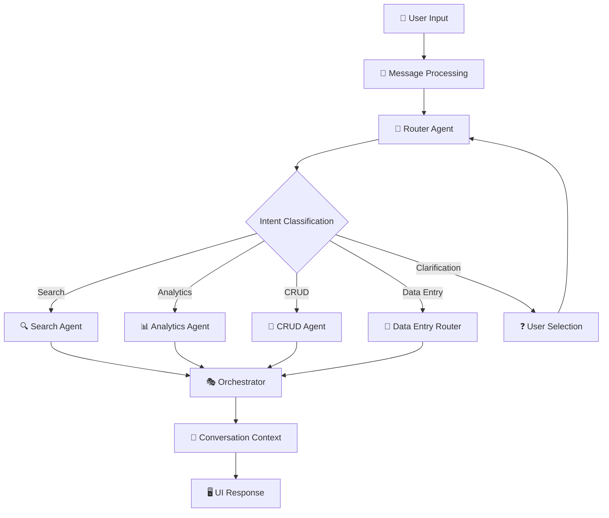

### Detailed Agent Routing Logic

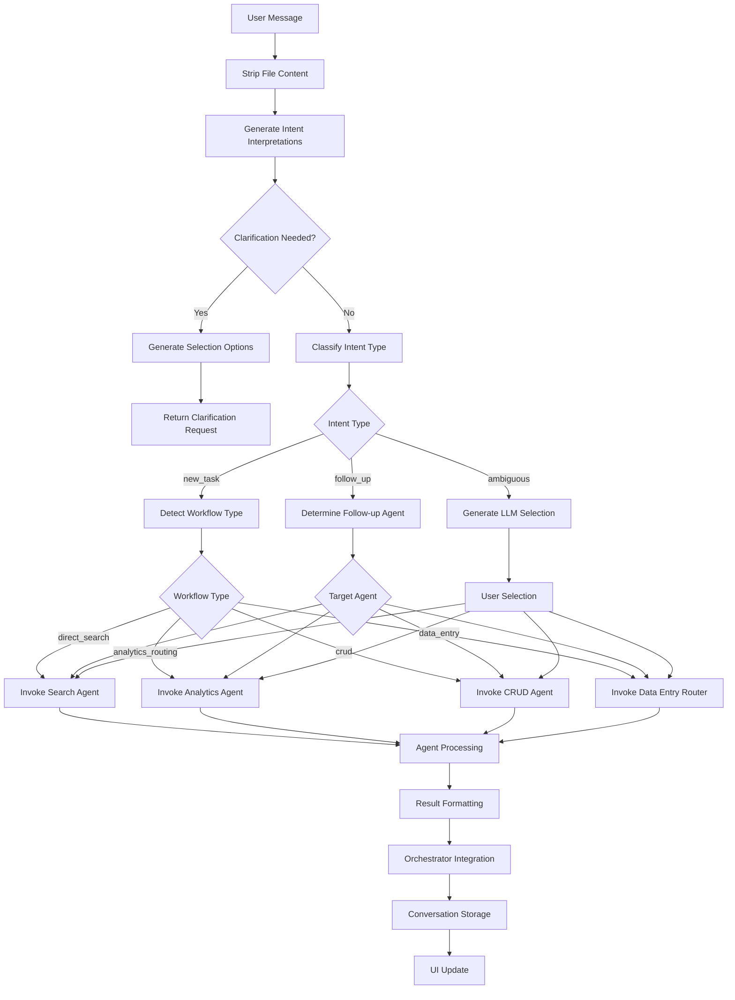

### Message Processing Flow

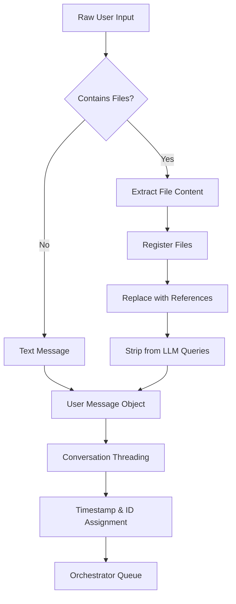

---

## 🔍 **Metadata Search → Data Query → Chart Generation Flow**

### Complete Analytics Pipeline

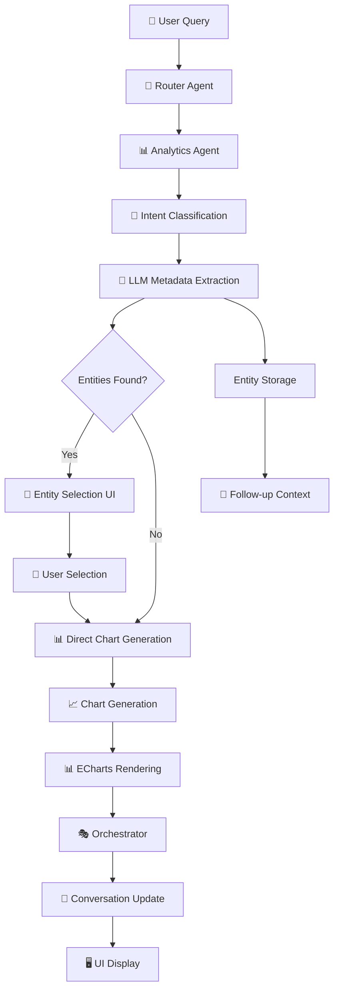

### Metadata Extraction Process

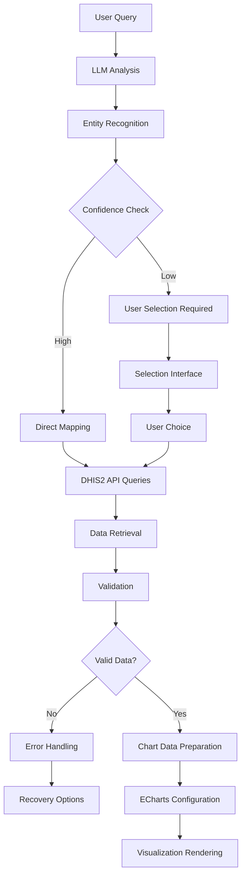

### Chart Generation Workflow

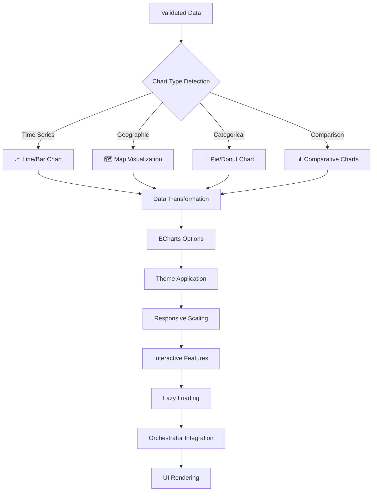

---

## 🚨 **Error Recovery Data Flows**

### Error Classification Pipeline

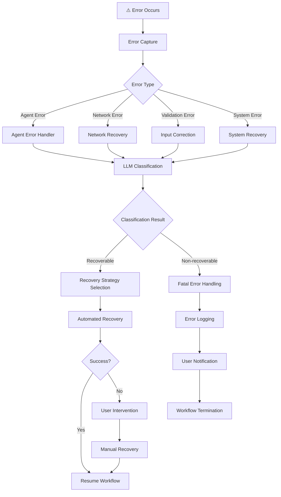

### Workflow Recovery Patterns

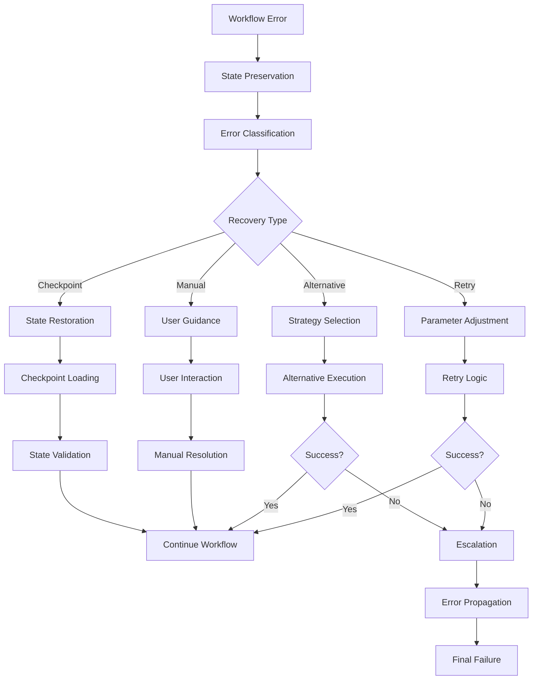

### Multi-Level Error Recovery

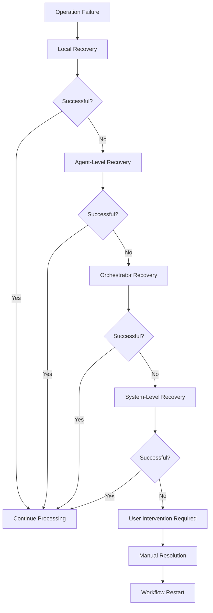

---

## 📁 **File Upload and Processing Flows**

### File Upload Pipeline

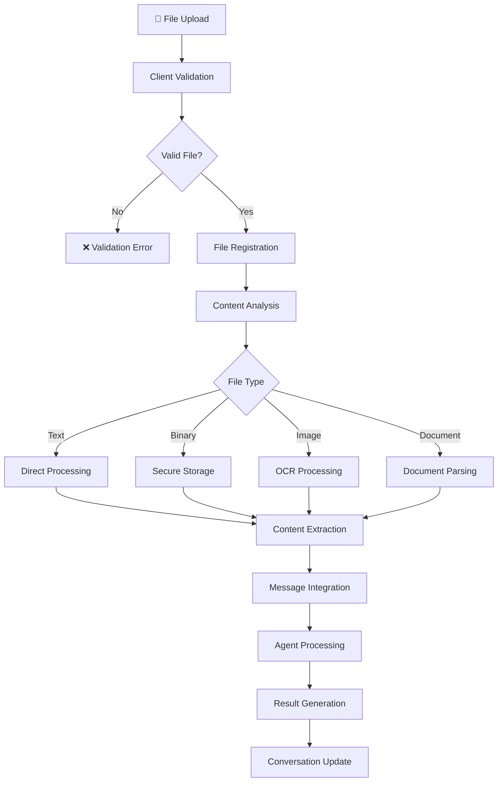

### Document Processing Workflow

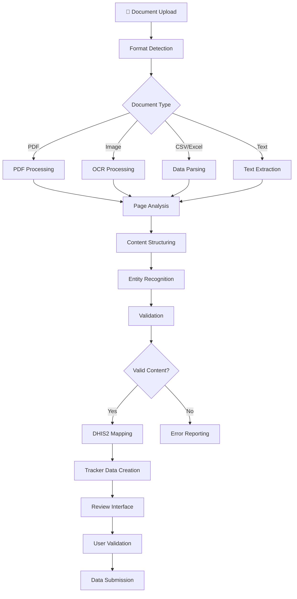

### CSV Processing Flow

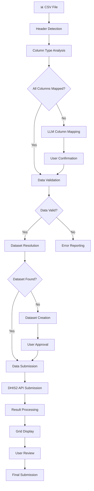

### Secure File Handling

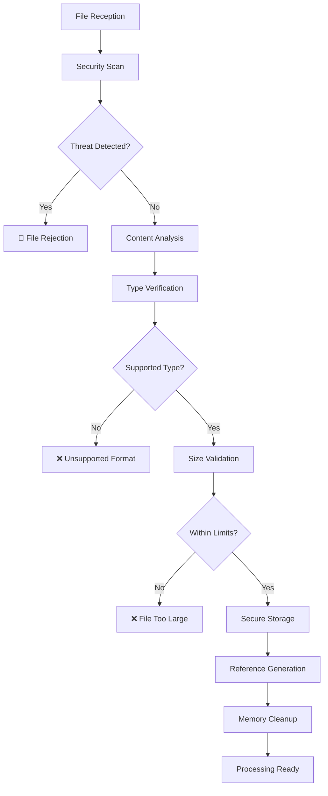

---

## 🔄 **System Integration Flows**

### Cross-Agent Communication

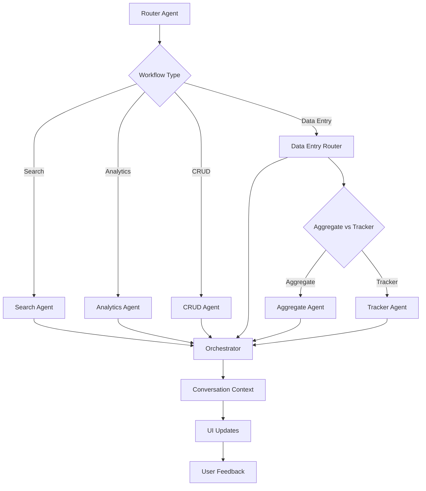

### State Persistence Flow

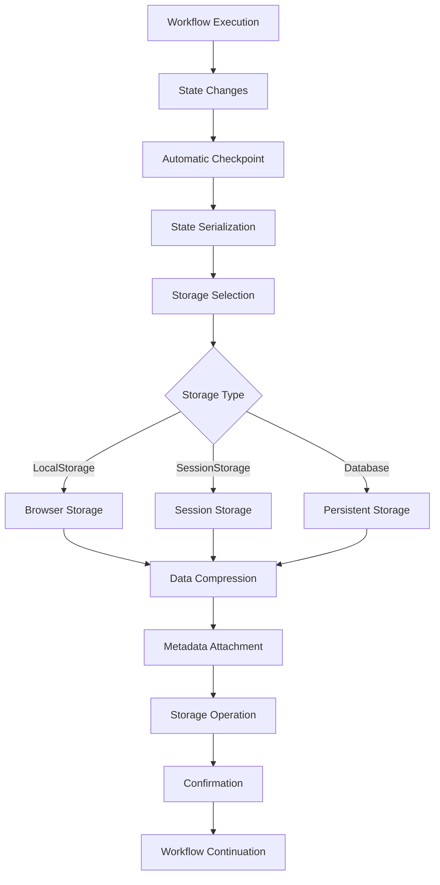

### Performance Monitoring Flow

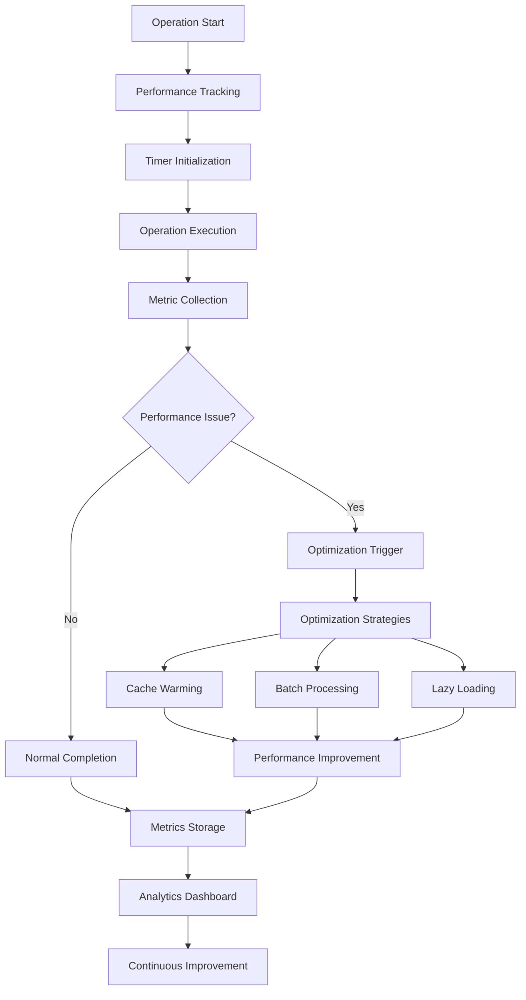

---

## 🎯 **Data Flow Patterns Summary**

### **Primary Flow Categories**

1. **Query Processing Flow**: User input → Intent classification → Agent routing → Result generation
2. **Analytics Flow**: Query analysis → Metadata extraction → Data retrieval → Visualization
3. **CRUD Operations Flow**: Planning → Resource preparation → Execution → Confirmation
4. **Error Recovery Flow**: Error detection → Classification → Recovery strategy → Resolution
5. **File Processing Flow**: Upload → Validation → Processing → Integration

### **Key Integration Points**

- **Orchestrator** as central coordination hub
- **Conversation Context** for state persistence
- **LLM Services** for intelligent processing
- **DHIS2 API** for data operations
- **UI Components** for user interaction

### **Performance Characteristics**

- **Asynchronous Processing**: Non-blocking operations
- **Caching Layers**: Multiple levels of optimization
- **Progressive Loading**: Lazy loading for heavy components
- **Error Resilience**: Graceful degradation and recovery
- **Scalable Architecture**: Modular design for extension

These data flow diagrams provide a comprehensive view of how data moves through the DHIS2 AI Suite, enabling developers to understand system interactions, debug issues, and optimize performance.
